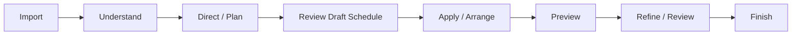
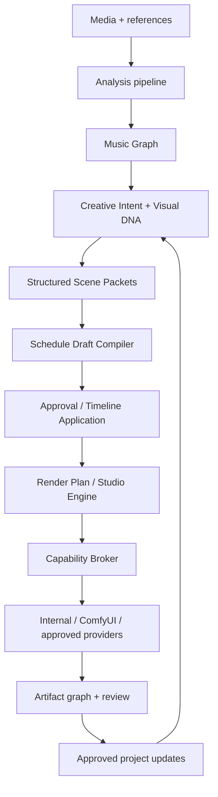

# DWCT Studio Project Blueprint — Unified Master Plan

**Prepared:** September 7, 2026  
**Applies to:** `codex/Unified` in `E:\DWCTGenerativeSoundStudio`  
**Canonical product:** EDMG Studio — WinUI Windows client + shared Studio backend + supported Electron/React compatibility client + local rendering/runtime + release tooling  
**Primary document path:** `docs/DWCT-Studio-Project-Blueprint.md`

> This file is the unified controlling blueprint. It absorbs the September 7 DWCT Studio Project Blueprint, the Unified AI Planner / Automatic Keyframe plan, the Whole-project Remediation plan, the August Release-Convergence Status, and the July Modernization Master Blueprint.

---

## 0. Authority, precedence, and how to use this blueprint

### 0.1 Source precedence

When the source documents disagree, use this order:

1. **This unified blueprint** after it is adopted.
2. **`docs/DWCT-Studio-Project-Blueprint.md` — September 7, 2026** for current product direction, WinUI-first delivery, current resource policy, continuity, save safety, and CUDA proof requirements.
3. **Unified AI Planner / Automatic Keyframe plan — September 7, 2026** for planner, schedule-draft, approval/application, and adaptive Studio Engine behavior.
4. **Whole-project Remediation plan — September 7, 2026** for security, revisions, media, cancellation, client reliability, process supervision, installer, and supply-chain hardening.
5. **`MODERNIZATION_STATUS.md` — August 6, 2026** for the latest supplied implementation/release status and evidence still required.
6. **`DWCTGenerativeSoundStudio_MASTER_BLUEPRINT.md` — July 14, 2026** for architectural intent, product principles, canonical domain/data designs, long-term feature scope, work-package IDs, and historical acceptance criteria.

Historical `Partial`, `Not started`, or day-by-day labels from July do **not** override newer implementation truth.

### 0.2 Mandatory "verify before skipping" rule

An item may be skipped only when all of the following are true on the **current worktree**:

- the implementation still exists;
- the relevant contract/schema is still compatible;
- focused regression tests pass;
- the relevant client path still works;
- no newer change has regressed the behavior;
- evidence required by the current phase is recorded.

If any check fails, reopen the item under its workstream. Do **not** rebuild a subsystem merely because an older planning ledger says it was incomplete.

### 0.3 What this blueprint does not authorize

This document does **not** by itself authorize:

- reverting or overwriting user-owned tracked, staged, untracked, or generated work;
- commits, pushes, merges, branch-protection changes, or publication;
- large model downloads;
- installer execution that mutates the host;
- pagefile changes;
- cloud/GPU spend;
- destructive cleanup;
- release publication;
- credential or signing-identity changes.

Those actions require an explicit instruction at execution time.

### 0.4 Status legend

| Status | Meaning |
|---|---|
| **VERIFY / SKIP IF GREEN** | Implementation is reported as present. Recheck it; do not redo it when current evidence passes. |
| **ACTIVE** | Core implementation or integration work remains. |
| **PARTIAL** | Foundation exists, but the unified acceptance contract is incomplete. |
| **BLOCKED EVIDENCE** | Code may exist, but release-grade proof needs hardware, credentials, clean-machine testing, repository admin action, or another external prerequisite. |
| **LABS** | Experimental expansion; cannot block core Studio completion unless explicitly promoted. |
| **RETIRED / COMPAT** | Retain only for compatibility; do not build new architecture around it. |

---

# 1. Product outcome

EDMG Studio should let a creator:

1. import audio and references;
2. understand musical structure;
3. build an AI-assisted visual plan;
4. inspect and edit structured scene intent;
5. preserve character, environment, style, camera, and state continuity;
6. receive an automatic **draft** keyframe schedule;
7. approve and atomically apply that draft to the timeline;
8. preview and refine variants;
9. render through one adaptive Studio Engine;
10. produce genuine temporal video when requested;
11. review provenance and artifacts;
12. save, reload, recover, migrate, and reopen the project without silent state loss or stale-write overwrites.

The product promise is:

> **Import a track. Understand its musical structure. Direct a coherent visual world. Approve an inspectable production plan. Let the Studio schedule and route the work. Finish the same idea across preview and final quality without rebuilding the project.**

---

# 2. Non-negotiable product decisions

| Decision | Controlling behavior |
|---|---|
| **WinUI-first delivery** | Prove the full native Windows workflow first. Electron/React remains supported and must consume the same backend contracts. |
| **Backend authority** | Backend owns project identity, revision, persisted state, media authorization, artifact paths, scheduling truth, engine resolution, and terminal job outcomes. |
| **One canonical render loop** | Preserve `studio/edmg-studio/python_backend/edmg_studio_backend/services/internal_video.py` as the canonical internal renderer. Extract bounded services around it; do not create a second canonical render loop. |
| **Creator approval** | AI proposals are inspectable, editable, attributable, reversible, and non-destructive until approved. |
| **Automatic keyframes = draft first** | Every plan variant can receive a schedule draft, but the active timeline changes only after explicit approval/application. |
| **Continuity is data** | Characters, settings, palette/style, shot type, start/end state, handoffs, references, screen direction, lenses, and schedule decisions are persisted, not reconstructed from prose. |
| **Intent is engine-neutral** | User-facing Creative Intent and Scene Intent must not be thin wrappers around model-specific parameters. |
| **Style is creative direction** | Style affects structured intent, prompt compilation, and renderer settings. It is not a separate top-level render pipeline. |
| **Truthful engine selection** | Never label a still assembly, slideshow, proxy, mock, cached artifact, or hosted fallback as genuine internal temporal motion. |
| **Local-first, provider-capable** | Cloud/remote providers may exist behind capability contracts, but internal-only requests must stay internal or fail preflight clearly. |
| **Safe mutation** | State-changing requests use expected revisions; stale writes become explicit reload/reapply flows rather than silent replacement. |
| **Secure media** | Public legacy media access defaults off. Signed URLs are short-lived, scoped, containment-checked, and `no-store`. |
| **Resource discipline** | **WinUI temporary media spool default = 512 MiB**, configurable. This supersedes the older remediation-plan 4 GiB proposal. No automatic model downloads or pagefile changes. |
| **Evidence before release claims** | Code existence is not release completion. UI, contracts, tests, packaging, signatures, clean-machine behavior, upgrade behavior, GPU evidence, docs, and recovery must agree. |

---

# 3. North-star creator flow



1. **Import** — audio, lyrics, reference images/video, character/product/brand assets.
2. **Understand** — beat grid, sections, stems, lyrics, energy arc, semantics, confidence.
3. **Direct / Plan** — director mode, visual world, Visual DNA, continuity anchors, structured scenes, render budget.
4. **Review Draft Schedule** — scene anchors, key images, camera keys, motion envelopes, musical markers, warnings, provenance.
5. **Apply / Arrange** — atomic planner-owned timeline application while preserving user-owned/locked content.
6. **Preview** — same scene/timing contract at lower cost.
7. **Refine / Review** — compare variants, lock successful frames/traits, edit intent, promote hero shots.
8. **Finish** — adaptive render routing, genuine temporal generation when required, assembly, audio sync, artifact/provenance validation, export.

Reactive Lab remains an **advanced remapping/editor surface**, not a required step in the normal plan-to-render workflow.

---

# 4. Baseline: implemented foundations that must be revalidated, not rebuilt

The following are reported as already present in the supplied status/September checkpoint. Treat them as **VERIFY / SKIP IF GREEN**.

| Area | Reported implementation | Current verification gate |
|---|---|---|
| Project durability | Versioned project manifests, validation, migrations, backups, atomic writes | Legacy/current round-trip, unknown-field preservation, migration failure recovery, atomic replacement |
| Project revisions | Durable revision/compare-and-set work present in remediation checkpoints | Save/autosave/recovery/upload/plan/render mutation tests; stale write returns actionable 409 |
| Jobs | SQLite/WAL jobs/events, leases, retries, idempotency, recovery | Restart, lease expiry, retry, cancel, terminal-state ownership, artifact publication |
| Autosave/recovery | Journals, recovery paths, project-health paths | Forced termination/reopen, recovery merge, reserved metadata protection |
| Contracts | Typed v1 domain contracts and compatibility adapters | Current backend/frontend contract suite; drift detection; generated-authority gap remains active |
| Timeline | Undo/redo foundations and command work | Move/trim/delete/split/property coverage; serialization/history/reopen |
| Music intelligence | Music Graph v1, corrections/reverts, Director modes, Visual DNA, motion grammar, stem modulation | Golden graph, correction invalidation, confidence/offline paths, client parity |
| Render planning | Render Plan v1, continuity validation, variant review, provider/model lanes, promotion paths | DAG/immutability/cache identity, cross-lane equivalence, review provenance |
| Live/world foundations | Live cues/assets, world adapters, templates, performer foundations | Keep behind LABS gates; do not block core |
| Python reproducibility | Frozen uv accelerator profiles and release-bundle provenance | Re-run frozen profile/lock/entry-point checks on current source |
| Release evidence tooling | CycloneDX/checksums and fail-closed signing hooks | Fresh candidate SBOM/checksum/signature evidence |
| Packaged proof harnesses | Customer-flow, migration, upgrade, zero-state harnesses | Run against exact final candidate |
| Build identity | Source/binary/dependency-lock fingerprints | Add/archive-safe Git commit + dirty-state identity |
| TensorRT migration | Source-preserving legacy engine migration; server-resolved bundle paths | Re-run partial/unsafe/disk/path rejection + readiness evidence |
| Simulated TensorRT Deforum | Retired; deprecated route adapts to canonical internal renderer | Compatibility test only; do not restore as a parallel renderer |
| Storyboard continuity | Setting, shot type, character/style locks, start/end state, scene handoffs reportedly save/reload | Backend + Electron + WinUI regression, including exact handoff preservation after reorder |
| Media signing | Signing helpers/core remediation integration reportedly landed | Full issuance/tamper/containment/range/HEAD/rotation/preview/error-cache regression |
| Planner foundation | Backend schedule models/routes, Electron contract work, WinUI planner work reportedly present | WinUI end-to-end planner/app-build proof, then Electron parity |
| WinUI token/native stability | Repair work reportedly present | Core tests + build + launched app; no dispatcher/cancellation/token-cache crash |
| CUDA-capable runtime | Later inspection reportedly found CUDA-capable Torch | Fresh preflight immediately before proof; no assumption from old environment state |

### 4.1 Still incomplete according to the newest supplied status

These remain **ACTIVE/PARTIAL** even if older components exist:

- `edmg_studio_backend/app.py` remains oversized.
- Render, Timeline, Settings, and workbench pages remain large feature monoliths.
- HTTP and Electron/browser contracts are not generated/enforced from one authority.
- Not every task uses one uniform durable job state machine and recovery UI.
- Model manifests/providers do not yet enforce every required license, checksum, immutable revision, resources, cancellation, provenance, and fallback field.
- Accessibility/reduced-motion/scaling/keyboard/flash-safety evidence is incomplete.
- Named-hardware render quality/performance/cancel/recovery evidence is incomplete.
- Packaged provenance still needs archive-safe Git commit/dirty identity.
- Signed installers, clean-machine install, real previous-version upgrade, rollback, and publication evidence remain open.

---

# 5. Canonical architecture

## 5.1 End-to-end architecture



## 5.2 Four independent rendering layers

Do not collapse these into one opaque renderer:

1. **Generation** — images, clips, masks, depth, motion, scene proposals.
2. **Modulation** — musical signals and authored envelopes into bounded parameters.
3. **Transitions** — cuts, bridges, match cuts, dissolves, interpolation, scene continuity.
4. **Output routing** — proxy/final engine, compute target, assembly, encoding, delivery.

## 5.3 Canonical/compatibility path rules

| Path | Role |
|---|---|
| `studio/edmg-studio-winui` | **Primary Windows frontend** |
| `studio/edmg-studio` | Canonical backend + React/Electron compatibility client + qualified packaging lanes |
| `studio/edmg-studio/python_backend/edmg_studio_backend` | Canonical Studio backend |
| `.../services/internal_video.py` | Canonical internal render behavior |
| `.../enhanced_deforum_music_generator` | Canonical bundled engine package through stable facades |
| Repository root | Workspace/orchestration/tests/docs/compatibility launchers; do not create a second app |
| Root `enhanced_deforum_music_generator`, `utils`, `config`, `core`, `edmg` wrappers | **Compatibility only; no new imports** |
| Root `librosa` shadow | Compatibility; namespace/retire before future Python upgrade |
| `desktop/electron` | Legacy shell; freeze and retire only after migration/launch proof |
| `chatgpt-apps/edmg-director` | Optional sidecar; never owns separate canonical project state |
| ComfyUI | Optional capability-gated provider |
| Triton | Research-only; excluded from core 1.2.0 requirements unless scope changes |

## 5.4 Target modular-monolith domains

Backend target:

```text
python_backend/edmg_studio_backend/
  api/
    projects.py
    analysis.py
    timeline.py
    renders.py
    models.py
    system.py
  domain/
    music_graph/
    creative_intent/
    visual_dna/
    scene_graph/
    render_plans/
    artifacts/
  services/
    analysis/
    conductor/
    renderer/
    review/
    providers/
  infrastructure/
    database/
    filesystem/
    ffmpeg/
    model_store/
    telemetry/
  workers/
    scheduler.py
    executor.py
    recovery.py
```

React/Electron compatibility-client target:

```text
studio/edmg-studio/src/
  app/
  features/
    project/
    analysis/
    director/
    timeline/
    render-lab/
    review/
    models/
    system/
  entities/
    music-graph/
    scene/
    render-plan/
    artifact/
  shared/
    api/
    components/
    commands/
    state/
    validation/
```

Do not split files merely to reduce line count. Every extraction must establish a real ownership boundary.

---

# 6. Canonical data contracts

All persisted/public documents should use stable IDs, schema versions where applicable, timestamps, migrations, and atomic writes. Preserve unknown compatible legacy fields.

## 6.1 Project document

Required concepts:

- `id`
- `revision`
- project setting/world
- character/style/continuity locks
- scene setting and `shot_type`
- `start_state`
- `end_state`
- exact scene `handoff`
- planner plan variants
- planner `schedule_draft`
- active/applied schedule identity
- review state
- timeline ownership/source identifiers
- artifact references/provenance

Client mutations carry expected revision; server returns resulting revision.

## 6.2 Music Graph

Canonical time-aware analysis shared by analyzer, planner, timeline, conductor, and Labs adapters:

- source/timebase/duration;
- tempo and confidence;
- meter;
- beats/bars/sections;
- stems and feature curves;
- optional lyrics with timestamps;
- optional harmony;
- loudness/onset/spectral/brightness/harmonicity/energy curves;
- semantic tags with confidence;
- analysis provenance/algorithm identity.

## 6.3 Creative Intent

Engine-neutral:

- director mode;
- concept/audience;
- aspect ratio(s);
- world bible;
- continuity anchors;
- palette/texture/lens/composition/motion grammar/forbidden traits;
- quality/time/cost budget;
- accessibility constraints.

Director modes remain strategy presets:

- Narrative
- Performance
- Abstract
- Lyric
- Product
- Ambient

## 6.4 Structured Scene Packet

Each planned scene must carry:

- scene timing and musical-section identity;
- rationale / creative intent;
- subject;
- setting/environment;
- action;
- shot composition;
- camera path;
- environmental motion;
- transition;
- continuity references;
- exact start/end-state locks;
- renderer-safe positive prompt derived from fields;
- negative prompt;
- model/engine hints;
- keyframe-anchor hints;
- motion intensity;
- quality priority;
- locks;
- provenance/reason.

**Structured fields are the source of truth.** Regenerate concise operational prompts after structured edits.

## 6.5 Schedule Draft

Every selected plan variant can own a versioned `schedule_draft` with:

- source project revision;
- source analysis revision;
- source plan revision;
- selected FPS;
- duration/timebase;
- prompt anchors;
- visual/key-image anchors;
- camera keys;
- subject/environment motion keys;
- parameter keys where supported;
- beat/onset/phrase/section/transition markers;
- continuity propagation;
- warnings;
- generation timestamp;
- provenance and reason for every generated point.

A schedule draft is **not active** until explicitly approved/applied.

## 6.6 Render Plan

Versioned, inspectable job DAG:

- plan ID/revision;
- intent/project/schedule revisions;
- tasks;
- dependencies;
- capability requirements;
- provider allocation;
- allowed fallbacks;
- time/VRAM/disk/cost estimates;
- warnings;
- immutable cache identity.

## 6.7 Artifact manifest

Every generated artifact should record:

- hash;
- relative project path;
- source asset hashes;
- project/scene/plan/schedule revisions;
- engine/provider/model and immutable revision;
- runtime/package versions;
- prompts/control inputs;
- seed;
- hardware summary;
- elapsed time;
- license/safety metadata;
- parent/child lineage;
- review state;
- approved Visual DNA updates.

---

# 7. Execution roadmap

The phases below replace the older "seven-day" status model as the main execution order. Historical IDs are retained for traceability.

---

## Phase 0 — Establish current truth before changing code

**Goal:** determine what can actually be skipped.

### Actions

1. Record:
   - branch;
   - HEAD;
   - `git status`;
   - staged/untracked/generated changes;
   - branch divergence/equality;
   - source ownership boundaries.
2. Verify canonical project/backend/client paths.
3. Run focused smoke tests for all "VERIFY / SKIP IF GREEN" foundations.
4. Record current Python/uv/pnpm/.NET/Go toolchain identity used by this worktree.
5. Record current backend command line and endpoint.
6. Do not commit or clean anything as part of this gate.

### Exit criteria

- A current verification matrix says **GREEN**, **REOPEN**, or **BLOCKED EVIDENCE** for each supposedly completed foundation.
- User-owned changes are identified and protected.
- No historical status is being treated as current evidence without a recheck.

---

## Phase 1 — Secure, save-safe, revision-safe platform

### 1A. Signed media and preview security

**Reported state:** core signing work exists → **VERIFY / SKIP IF GREEN**.

Required behavior:

- authenticated, project-scoped batch issuance;
- HMAC-SHA256 signed URLs;
- preferred key `EDMG_MEDIA_SIGNING_SECRET`;
- optional previous key for rotation;
- canonical path + sorted query signing;
- configurable TTL, default 15 minutes, allowed 1–60 minutes;
- GET/HEAD only on allowlisted routes;
- constant-time verification;
- strict expiry/clock validation;
- identical authorization for byte ranges;
- `Cache-Control: no-store`;
- public legacy media GET compatibility disabled by default;
- project-directory containment on every media route;
- reject traversal, absolute paths, symlink escapes, malformed encodings;
- renew long-lived client URLs before expiry.

Preview budget guardrails:

- max 2048 per dimension;
- max 4,194,304 pixels/frame;
- standard segment: max 10 s / 12 FPS / 120 frames / 125,829,120 pixel-frames;
- diffusion segment: max 5 s / 8 FPS / 40 frames / 1024 per dimension / 30 steps / 41,943,040 pixel-frames.

**Acceptance:**

- issuance;
- expiry;
- tampering;
- query/path repurposing;
- key rotation;
- containment;
- traversal/symlink;
- range;
- HEAD;
- preview budget;
- error response caching;
- Electron renewal;
- WinUI playback/preview.

### 1B. Revisioned project persistence

**Reported state:** foundations exist → **VERIFY / SKIP IF GREEN**, reopen gaps only.

Required behavior:

- durable integer revisions;
- migrate legacy docs without deleting unknown fields;
- keyed per-project synchronization;
- temp-write + atomic replace;
- expected revision on mutations;
- exactly one increment per successful write;
- stable HTTP 409 with current revision on stale writes;
- background jobs merge only owned fields;
- bounded CAS retries only when merge is deterministic;
- server-owned identity/revision/audio/artifact/path fields cannot be overwritten by loose metadata patches.

**Acceptance:**

- save/autosave/recovery/upload/planning/apply/render all honor revision;
- stale UI save cannot overwrite a newer edit;
- background completion cannot clobber newer interactive state;
- migration/round-trip preserves legacy compatible fields.

### 1C. Jobs, cancellation, recovery, artifact publication

**Reported state:** SQLite/WAL infrastructure exists; uniform adoption remains **PARTIAL**.

Required behavior:

- one durable job state model;
- jobs/events/attempts/leases/dependencies/artifacts/logs;
- idempotency;
- heartbeat/orphan recovery;
- pause/cancel/retry/resume where supported;
- conditional terminal transitions;
- a canceled worker cannot later mark success/failure incorrectly;
- canceled work cannot publish final project mutation/output registration;
- one common recovery/status UI model.

### 1D. Client reliability — WinUI first

#### WinUI

- same signed-media contract as React/Electron;
- **512 MiB default** temporary media spool, configurable;
- early known-length rejection;
- bounded streaming for unknown length;
- cleanup partial temp files on all failure/cancel paths;
- preserve byte-range playback;
- process-wide backend-token cache invalidation;
- preserve user-owned token-provider edits;
- distinguish auth / transport / cancellation / backend-health failures;
- marshal UI state changes through dispatcher;
- no cancellation/dispatcher crashes.

#### React/Electron

- signed media helper + abort-aware renewal;
- preserve playback position/state during renewal;
- revoke object URLs;
- revision-aware writes and 409 UI;
- completion-scheduled abort-aware polling, not overlapping `setInterval`;
- correct `{ ok, canceled, paths }` picker contract;
- backend-scoped state keyed by normalized backend URL;
- switching backend aborts requests and clears stale backend-specific data.

---

## Phase 2 — Unified AI Planner and Automatic Keyframe Scheduling

**Reported state:** planner foundations exist; complete native workflow proof remains **ACTIVE**.

### 2A. One normal action: `Analyze and Build Plan`

Normal user flow should produce together:

- analysis;
- plan variants;
- structured scene packets;
- renderer-safe derived prompts;
- automatic keyframe schedule drafts.

Audio-only analysis remains diagnostic/advanced.

### 2B. Planner explanation model

For each section, show:

- what the music is doing;
- confidence and unavailable inputs;
- what visual decision was made;
- why it was made;
- which prompt/keyframe/motion/transition behavior follows.

Do not fabricate transcript/tempo evidence. Missing transcript/BPM produces a valid section/energy-based draft plus visible warnings.

### 2C. Schedule compiler

Backend owns scheduling. Clients render the result; they do not reimplement scheduling logic.

Compiler triggers:

- plan generated;
- plan regenerated;
- imported from Planner Lab;
- material structured-scene edit.

Rules:

- use project duration + selected output FPS + frames + BPM/beat grid + analysis sections;
- remove hard-coded 24 FPS assumptions;
- always anchor scene starts/ends;
- use major musical events rather than fixed intervals alone;
- lower key density in stable passages;
- increase meaningful motion detail around rises, impacts, hooks, transitions;
- apply normalization, attack/release smoothing, thresholds, nonlinear mapping, clamps, rate limits;
- previous scene end-state becomes next scene start anchor;
- propagate character/environment/palette/style/screen-direction locks;
- record source/reason for each point.

### 2D. Approval and atomic application

Primary action:

**Approve Plan and Apply Schedule**

Atomically create/update planner-owned:

- prompt track;
- visual/key-image anchor track;
- motion/parameter track;
- camera track;
- musical markers;
- transition cues.

Rules:

- stable planner ownership/source IDs;
- preserve user-authored tracks;
- preserve manually authored or explicitly locked keys;
- stale draft/project revision rejects cleanly;
- `Regenerate Draft` affects draft only;
- `Reset Planner-Owned Schedule` requires confirmation;
- `Open in Timeline` moves to refinement.

### 2E. Planner acceptance

Backend:

- deterministic schedule fixtures;
- every scene has valid prompt/continuity anchors;
- exact adjacent handoffs;
- ordered/deduplicated/clamped keys;
- seconds↔frames consistency;
- safe missing-BPM/transcript behavior;
- regeneration does not change active timeline;
- stale apply rejected.

WinUI first:

- generate;
- inspect;
- edit structured scene;
- regenerate draft;
- approve/apply;
- save;
- reload;
- reopen;
- preserve exact continuity/revision.

Electron parity follows against the same contracts.

---

## Phase 3 — One adaptive Studio Engine / Render Conductor

### 3A. Replace competing top-level workflows

The Render surface exposes:

- result intent: full-motion / still sequence / edit existing;
- quality target;
- aspect ratio/resolution;
- output FPS;
- optional model preference;
- one preflight;
- one Render action;
- one Advanced Engine disclosure.

Advanced groups:

1. keyframe/image generation;
2. temporal motion generation;
3. camera/audio-reactive modulation;
4. interpolation/finishing;
5. model/runtime overrides.

Existing internal, TensorRT, SVD, AnimateDiff, ComfyUI, hosted, still, timeline capabilities remain components/providers where valid; consolidation does not delete working backends.

### 3B. `Auto` route

Select an eligible real renderer using:

- scene requirements;
- approved schedule;
- temporal-motion requirement;
- installed/verified model capabilities;
- GPU/VRAM/runtime constraints;
- quality/speed/continuity;
- privacy/locality;
- cost where external providers are allowed.

Preflight must show:

- selected route;
- keyframe renderer;
- temporal renderer;
- models/revisions;
- capability evidence;
- allowed fallbacks;
- incompatibilities;
- reason for selection.

### 3C. Truthfulness requirements

- still/keyframe generation is not temporal motion;
- slideshow assembly is not temporal motion;
- proxy/mock/cached output is not a successful fresh internal proof;
- internal-only cannot silently route hosted;
- unsupported engine/model combinations fail preflight clearly.

### 3D. Conductor responsibilities

- compile approved intent/timeline into a versioned DAG;
- validate assets, continuity, unsupported capabilities, unsafe settings;
- reserve resources;
- order dependencies;
- reuse cache by content identity;
- pause/cancel/retry/resume/fallback/partial completion where supported;
- estimate external cost before submission;
- emit artifact manifest;
- never mutate authored timeline while executing.

### 3E. Capability broker

Providers declare capabilities, not UI brand assumptions:

- media type;
- operation;
- supported controls;
- max duration;
- resolutions;
- determinism;
- cancellation;
- locality.

### 3F. Existing creative/conductor foundations to verify

**VERIFY / SKIP IF GREEN:**

- Visual DNA inspect/approve/deprecate;
- six Director modes;
- motion grammar;
- stem modulation;
- Render Plan v1;
- continuity validation;
- variant review;
- provider/model lanes;
- proxy→hero promotion.

**ACTIVE/PARTIAL:**

- immutable/executable DAG behavior;
- one capability conformance contract;
- cross-lane timing/framing/control equivalence;
- full budget reallocation/explanation;
- complete variant review provenance/cherry-pick/locks;
- typed continuity conflict validation across all relevant dimensions.

---

## Phase 4 — Music intelligence and creative system completion

### 4A. Two-layer analysis

Deterministic/offline foundation:

- decode/normalize;
- loudness/peaks/silence;
- tempo/beat/downbeat/meter/onset;
- bars/phrases/sections;
- spectral/chroma/harmonic-percussive/energy/brightness;
- optional source separation;
- cache by source hash + algorithm version + parameters.

Learned layer:

- semantic audio/text embeddings;
- mood/instrument/scene retrieval;
- ASR/lyrics with timestamps and confidence;
- optional classifiers;
- additive, confidence-bearing, optional/offline-safe.

### 4B. Musical timescales

- **Fast 20–250 ms:** accents/particles/micro-events with rate limits.
- **Medium 0.25–4 s:** beats/bars/phrases/lyric lines for camera gestures, type, local transitions.
- **Slow 4–60 s:** sections/energy/harmony/narrative for scenes, palette, environments, shot scale, quality budget.

### 4C. Modulation contract

Each mapping declares:

- source + confidence;
- normalization/calibration;
- attack/release/smoothing/hysteresis;
- min/max + response curve;
- rate limit/saturation;
- authored-animation combination rule;
- preview/final determinism;
- accessibility cap.

Creator can freeze, mute, scale, or bake mappings.

### 4D. Motion grammar

Preserve/complete:

- Prepare
- Accent
- Travel
- Settle
- Contrast

Motion should be phrase-level musical direction, not beat-by-beat jitter.

### 4E. Creative features

| Feature | Unified status |
|---|---|
| Music Genome / Understand | PARTIAL — analysis UI exists; keep corrections and expand remaining beat/stem/energy editing as needed |
| Visual DNA | VERIFY / SKIP IF GREEN |
| Hero Shot allocation | PARTIAL — promotion exists; complete deterministic budget allocation/explanation |
| Variant lanes/review | VERIFY foundation; complete provenance/locks/cherry-pick |
| Continuity anchors | VERIFY persistence + typed validation; extend gaps |
| Semantic match-cut designer | ACTIVE only after core continuity/schedule contracts are stable |
| Stem-aware modulation matrix | Foundation exists; complete bounds/undo/bake/accessibility |
| Music-reactive typography | ACTIVE after core timeline ownership/contract work |
| Smart render budget | PARTIAL |
| Live Visual Set | LABS |

---

## Phase 5 — Architecture and contract convergence

### 5A. Backend decomposition

**ACTIVE**

- create/use small application factory;
- extract routers from `app.py` by domain ownership;
- preserve routes and persisted formats;
- service interfaces at FFmpeg/filesystem/model/provider/queue/clock boundaries;
- explicit Pydantic models at public/persisted boundaries;
- centralized error codes and actionable recovery;
- atomic output writes.

### 5B. One contract authority

**ACTIVE**

- OpenAPI/backend schema is authoritative;
- generate/validate frontend request/response contracts from that authority;
- validate Electron IPC request and response schemas;
- remove parallel hand-maintained contract drift.

### 5C. Frontend decomposition

**ACTIVE**

Extract real feature boundaries from:

- Render;
- Timeline;
- Settings;
- large workbenches.

Rules:

- durable project state separate from ephemeral UI/viewer state;
- command model for timeline mutation;
- standardized async states:
  - idle
  - validating
  - queued
  - running
  - paused
  - retryable
  - blocked
  - complete
  - canceled
- reduce `any` at API/timeline/render/IPC boundaries;
- selectors/virtualization for timeline performance.

### 5D. Electron/IPC hardening

- context isolation;
- minimal allowlisted IPC;
- schema validation both sides;
- renderer cannot pass arbitrary unsafely scoped paths;
- secrets in OS credential storage;
- secrets scrubbed from logs/crash reports;
- signed update channel only after reproducible packaging + rollback.

---

## Phase 6 — Model/runtime policy, Python reproducibility, and CUDA proof

### 6A. Model manifests

**ACTIVE/PARTIAL**

Every production-capable model entry must enforce:

- exact repository;
- immutable revision;
- capability;
- license ID/acceptance/commercial note;
- download/peak disk/RAM/VRAM;
- precision/quantization;
- runtime/package constraints;
- OS/GPU backend support;
- deterministic behavior/limitations;
- named-hardware quality/speed result;
- promotion lane;
- verified fallback.

Never silently update model revisions inside an existing project.

### 6B. Runtime lanes

- CPU/lightweight;
- local fast;
- local quality;
- managed local service (for example ComfyUI);
- external provider;
- bounded real-time/precomputed Labs lane.

### 6C. Model promotion gate

Before promotion:

- install/cold-start;
- representative 5–10 s shot;
- RAM/VRAM/disk/time;
- first/last frame adherence;
- camera/motion adherence;
- temporal consistency/identity drift;
- seed repeatability;
- cancel/OOM recovery;
- offline behavior;
- license/attribution;
- supported-platform evidence.

### 6D. Historical research candidates

The July blueprint named candidate models including Wan 2.x, LTX, SVD, CogVideoX, CLAP, Parakeet, VACE, and LongCat. Treat that list as **research input only**. Re-review revision, license, runtime compatibility, and benchmark evidence before changing any lane.

### 6E. Python/uv reproducibility

**Reported implemented foundation → VERIFY / SKIP IF GREEN**

- Python 3.12 target;
- canonical `studio/edmg-studio/python_backend/uv.lock`;
- explicit CPU / DirectML / CUDA profiles;
- frozen sync;
- release bundle derived from committed lock inputs;
- selected profile must be unambiguous.

Revalidate exact tool versions and supported entry points on the current candidate rather than copying August numbers forward blindly.

### 6F. Mandatory genuine internal CUDA motion proof

This is a hard acceptance gate, not a UI smoke test.

Before proof:

1. record actual backend/worker command line;
2. confirm selected project and revision;
3. confirm selected approved schedule;
4. confirm GPU visibility and usable VRAM;
5. confirm system/pagefile/commit headroom;
6. confirm required keyframe and temporal models;
7. confirm runtime and worker configuration;
8. confirm no hosted/proxy/mock/still-slideshow fallback is allowed.

Proof shot:

- short;
- low resolution;
- internal CUDA;
- storyboard full motion;
- FLUX keyframes where the current project/model configuration supports the requested proof;
- project-wide continuity;
- genuine temporal video generation.

Validate resulting MP4:

- fresh output timestamp/path;
- codec;
- duration;
- resolution/FPS;
- audio mux/sync;
- sampled-frame motion;
- content hash;
- artifact manifest;
- project/plan/schedule revision;
- keyframe engine/model;
- temporal engine/model;
- worker-level CUDA provenance;
- GPU/runtime provenance;
- cancellation/failure behavior where practical.

**Pass only if temporal motion was actually generated.** A keyframe sequence, slideshow, cached clip, hosted clip, proxy, or mock is a failure for this gate.

---

## Phase 7 — Process, installer, supply-chain, release, and customer proof

### 7A. Go supervisor

- write managed-backend state only after readiness passes;
- on timeout/failure terminate exact child process tree;
- await exit;
- remove only matching state;
- preserve original readiness error with cleanup context.

### 7B. Tk launcher

- process/network work on worker threads;
- all Tk control/dialog mutation through `root.after`;
- guard disposed-window callbacks;
- restore button/busy state on success/failure.

### 7C. Linux setup hardening

- no unverified `curl | sh`;
- pinned download + SHA-256;
- track exact Ollama PID, no broad `pkill -f`;
- pin ComfyUI/custom-node commits;
- checked-in constraints/lock inputs;
- checksums for model/bootstrap downloads;
- temp download → verify → atomic publish;
- explicit version/checksum override for intentional upgrades.

### 7D. Python installer

- resolve target interpreter once;
- use same interpreter for venv/create/install/verify/import/smoke;
- fail clearly on version/environment mismatch.

### 7E. Release candidate gates

Do not claim release complete until all applicable gates pass on the exact candidate:

1. reviewed candidate Git scope recorded;
2. source/lock/package/build identity recorded;
3. complete source gates on Windows and Ubuntu;
4. frontend lint/type/UI/build;
5. backend/repository suites;
6. contract-drift checks;
7. release tooling suite;
8. JS dependency audits;
9. fresh profile-specific backend bundle(s);
10. SBOM/checksum;
11. Authenticode signing of shipped executable(s), helpers, installer, uninstaller;
12. independent signature/timestamp verification;
13. zero-state clean Windows install;
14. first-run system-readiness flow;
15. starter/customer flow;
16. real upgrade from separately identified older installed baseline;
17. custom install directory;
18. custom Studio Home;
19. migration;
20. restart recovery;
21. cancellation cleanup;
22. uninstall data retention;
23. rollback;
24. legacy TensorRT partial/unsafe/disk rejection where supported;
25. named-hardware quality/VRAM/latency/cancel/recovery evidence;
26. security review;
27. accessibility review;
28. known issues;
29. branch-protection evidence before public promotion.

### 7F. Provenance

Packaged provenance must include:

- exact source identity;
- lock identity;
- binary identity;
- package identity;
- archive-safe Git commit;
- dirty/clean state.

Old build directories and old unit-test counts are not release evidence.

---

# 8. Accessibility, privacy, security, and responsible AI

## 8.1 Accessibility

Release requirements:

- keyboard path;
- visible focus;
- scalable text;
- high-DPI/scaling;
- WCAG-aware contrast;
- reduced motion;
- flash-frequency warnings/caps;
- readable kinetic typography;
- safe text zones where relevant.

## 8.2 Privacy

- project/analysis/embeddings/Visual DNA local by default;
- before external generation, show exactly what leaves device;
- telemetry opt-in, minimal, structured, viewable;
- local derived-data cleanup;
- remote reference deletion where provider permits.

## 8.3 Security

- sanitize filenames, archives, imported workflows, model paths, FFmpeg args;
- maintain `SECURITY.md` and supported-version policy;
- scan release artifacts for secrets;
- SBOM/checksums/signatures;
- explicit provider upload scopes/permissions;
- live-control endpoint allowlists.

## 8.4 Responsible model use

- show license/attribution before install/export;
- record model/revision in manifests;
- provenance metadata/watermark options without overclaiming detection;
- provider-appropriate safety controls;
- no persistent preference learning/training from user content unless explicitly enabled.

---

# 9. UX convergence

Target information architecture:

| Space | Primary question |
|---|---|
| Home | What am I working on and is the system healthy? |
| Understand | What is happening in the music? |
| Director / Planner | What visual world and grammar should this follow? |
| Timeline | What happens when? |
| Render / Studio Engine | How will it be made? |
| Review | Which result should survive? |
| Models | What capabilities are installed and qualified? |
| System | Can this machine complete the requested job? |

Simple and Advanced modes edit the **same canonical project data**.

Every long-running action should expose durable state and, where supported:

- cancel;
- retry;
- pause/resume;
- logs;
- recovery;
- affected scenes;
- estimate/cost/cache impact.

Every AI proposal should expose its evidence source.

---

# 10. Performance and storage budgets

Measure, do not guess:

- cold launch;
- project open by fixture size;
- timeline pan/zoom frame time;
- waveform/thumbnail cache hit;
- analysis time per audio minute;
- job claim latency;
- UI job update rate;
- no-model memory ceiling;
- render cancellation latency;
- disk requirement before task start.

Media/storage:

- project-relative asset references;
- content-addressed cache;
- asset index with hashes/probes/proxies/reference counts;
- originals separated from generated/proxy/cache/temp data;
- Project Health;
- Collect Project;
- Relink Missing;
- Clean Cache;
- Archive;
- cleanup never deletes originals.

---

# 11. Test strategy

## 11.1 Contract/unit

- project revisions/migrations;
- signed media;
- preview budgets;
- metadata reservations;
- Music Graph;
- structured scene compiler;
- schedule compiler;
- motion grammar;
- continuity handoff;
- Render Plan;
- capability selection;
- cancellation state transitions.

## 11.2 Component/client

WinUI:

- media;
- token invalidation;
- Setup error taxonomy/dispatcher;
- planner review/apply;
- save/reopen;
- render preflight/selection.

React/Electron:

- media renewal;
- revision conflicts;
- polling;
- backend switching;
- picker contract;
- planner schedule preview/apply;
- Studio Engine state.

## 11.3 Integration

- FFmpeg;
- SQLite leases/recovery;
- filesystem atomicity;
- IPC schemas;
- provider stubs;
- supervisor cleanup;
- installer interpreter;
- Linux setup checksum enforcement.

## 11.4 End-to-end

Core creator path:

`Import → Understand → Analyze and Build Plan → Review Schedule → Apply → Timeline → Studio Engine → Render → Review → Save/Reopen → Export`

Run with WinUI first, then Electron parity.

## 11.5 Media golden / GPU evidence

- analysis fixture;
- schedule JSON;
- scene handoff;
- output duration/sync;
- artifact manifest;
- genuine temporal CUDA proof on named hardware.

---

# 12. Definition of done

A feature is complete only when:

- current implementation exists;
- relevant contract/schema is documented;
- migration/backward compatibility is handled;
- success/loading/empty/cancel/failure/conflict states are handled;
- focused unit/contract tests pass;
- relevant integration/e2e test passes;
- WinUI path passes when it is a core Studio feature;
- Electron parity passes where required;
- logs are actionable and secret-safe;
- cache/provenance is defined;
- accessibility is checked for visible UI;
- performance/storage impact is measured for media/model work;
- docs/changelog are updated;
- release evidence is produced if the feature is being claimed in a release.

"Works in code" is not enough.

---

# 13. Release blockers — execution order

1. **Current-truth audit** of worktree and all verify/skip foundations.
2. Close any reopened security/revision/cancellation regressions.
3. Complete WinUI planner → schedule → save/reopen workflow.
4. Complete Electron parity.
5. Complete unified Studio Engine + truthful preflight.
6. Close contract-authority and job-state convergence gaps.
7. Close model-manifest/provider enforcement gaps.
8. Produce genuine internal CUDA temporal proof.
9. Complete full source/test/contract gates.
10. Build exact release candidate(s) from frozen inputs.
11. Sign and independently verify shipped artifacts.
12. Clean-machine install/customer proof.
13. Real previous-version upgrade + rollback proof.
14. Named-hardware performance/recovery evidence.
15. Accessibility/security/known-issues/branch-policy evidence.
16. Only then consider public promotion.

---

# 14. Labs / post-core expansion lane

Do not let this lane destabilize the core Studio.

Keep behind explicit flags and capability boundaries:

- OSC;
- MIDI;
- WebSocket;
- DMX;
- TouchDesigner;
- Unreal;
- precomputed live asset packs;
- performer/high-end external workflows;
- template packages;
- music-to-world cue graphs;
- experimental/research model adapters.

Promotion from LABS requires:

- stable contract;
- simulator/fixture;
- latency/resource budget;
- cancellation/failure behavior;
- provenance;
- security/privacy review;
- UI ownership;
- documentation.

---

# 15. Documentation set

Target set:

- `README.md`
- `docs/INSTALL.md`
- `docs/ARCHITECTURE.md`
- `docs/CREATOR_GUIDE.md`
- `docs/MODELS.md`
- `docs/PYTHON_TOOLCHAIN.md`
- `docs/PROJECT_FORMAT.md`
- `docs/COMPATIBILITY_MATRIX.md`
- `docs/BRANCH_POLICY.md`
- `RELEASE.md`
- `SECURITY.md`
- `CHANGELOG.md`
- repository `LICENSE`
- `docs/PLUGIN_SDK.md` only after the provider contract is actually stable.

Public roadmap should use **Now / Next / Labs**, not unsupported date promises.

---

# 16. Source-to-blueprint absorption map

| Source | What was absorbed |
|---|---|
| `docs/DWCT-Studio-Project-Blueprint.md` | Authority, WinUI-first strategy, backend authority, 512 MiB spool policy, continuity/save safety, September baseline, genuine CUDA proof |
| Unified AI Planner / Automatic Keyframe plan | Structured scene packets, automatic versioned schedule drafts, approval/application semantics, planner ownership, adaptive Studio Engine, same backend contracts for WinUI/Electron |
| Whole-project Remediation plan | Signed media, project revisions/CAS, preview limits, cancellation terminal-state rules, client reliability, Go/Tk/Linux/Python installer hardening, focused regression set |
| `MODERNIZATION_STATUS.md` | Current supplied implementation truth, canonical/compatibility paths, incomplete structural/evidence items, release blockers, distinction between code completion and release evidence |
| July Modernization Master Blueprint | Product principles, north-star UX, modular-monolith domains, Music Graph/Creative Intent/Scene Intent/Render Plan/artifact design, analysis/motion/modulation concepts, model policy, Conductor architecture, reliability/security/privacy/testing/docs, historical task IDs and Labs scope |

---

# 17. Historical work-package traceability

Use these IDs only as references to older commits/issues/docs. Current execution is governed by the phases above.

### Foundation / reliability

- `P0-01` CI/FFmpeg
- `P0-02` branch policy
- `P0-03` repository hygiene/security docs
- `P0-04` system readiness
- `P0-05` fixtures
- `P0-06` baseline benchmarks
- `W1-01` typed contracts
- `UV-01..04` Python/uv reproducibility and release bundle

### Durability

- `P1-01` project schemas/migrations
- `P1-02` durable jobs
- `P1-03` artifact manifests
- `P1-04` asset/project health
- `P1-05` autosave/recovery
- `P1-06` generated/validated client contracts

### Studio structure

- `P2-01` backend router/domain extraction
- `P2-02` timeline commands
- `P2-03` frontend feature extraction
- `P2-04` uniform job UX
- `P2-05` Understand
- `P2-06` first-run/starter flow

### Intelligence

- `P3-01` Music Graph
- `P3-02` learned analysis/ASR/semantic lane
- `P3-03` Director modes/planner
- `P3-04` Visual DNA
- `P3-05` motion grammar
- `P3-06` stem modulation

### Conductor

- `P4-01` Render Plan
- `P4-02` capability broker
- `P4-03` lane promotion
- `P4-04` smart budget
- `P4-05` variant review
- `P4-06` continuity validation

### Models / Labs / release

- `P5-01..04` model manifests, benchmarks, lanes, candidate adapters
- `P5-05` packaging/release evidence
- `P5-06` documentation
- `W6-01..05` live/world/template/performer Labs
- `W7-01..05` complete test/evidence/accessibility/performance/release handoff

---

# 18. Execution protocol for every implementation task

Before editing:

1. inspect current implementation;
2. inspect current tests;
3. inspect worktree ownership;
4. determine whether the item is already complete;
5. state the smallest viable change;
6. identify affected contracts;
7. identify migration/rollback risk.

During implementation:

- preserve unrelated behavior;
- preserve user-owned changes;
- update tests with code;
- keep errors actionable;
- do not add a new framework without evidence;
- do not create duplicate infrastructure;
- do not create a second canonical render loop.

Before finishing:

1. run narrow tests;
2. run relevant broader gates;
3. record changed files;
4. record contracts/schema changes;
5. record migration/rollback;
6. record test commands/results;
7. capture screenshots for visible UI;
8. record performance evidence for media/model/timeline work;
9. record unresolved risk;
10. mark the blueprint item green only when its acceptance criteria pass.

Create/update an ADR when changing:

- project format/migration;
- job persistence/state transitions;
- provider/capability interface;
- asset/cache identity;
- model promotion/license policy;
- IPC security boundary;
- supported platform/release channel;
- telemetry/privacy.

---

# 19. Immediate next execution sequence

This is the shortest safe path from the current supplied baseline to a trustworthy beta candidate.

### Gate A — Verify before rebuilding

- worktree/branch audit;
- project continuity regression;
- signed media regression;
- revision/CAS regression;
- SQLite job/cancel/recovery regression;
- uv/toolchain frozen check;
- current WinUI build/core tests.

### Gate B — Finish the user-critical native path

- WinUI `Analyze and Build Plan`;
- structured scene editing;
- automatic schedule draft;
- schedule preview/warnings;
- approve/apply;
- save/reopen;
- conflict behavior;
- signed media playback;
- Studio Engine preflight;
- render job lifecycle.

### Gate C — Electron parity

Run the same project/revision through the same backend contracts. Do not create client-specific scheduler or engine routing logic.

### Gate D — Engine/conductor truthfulness

- one Studio Engine state;
- one render-intent contract;
- resolved engine plan;
- genuine temporal route when requested;
- explicit failure when unavailable;
- artifact provenance.

### Gate E — Genuine CUDA proof

Produce and inspect a new internal temporal MP4. Do not accept still assembly/proxy/mock/hosted output.

### Gate F — Structural convergence

Close `app.py`, contract-authority, feature-monolith, uniform-job, and model-manifest gaps without rewriting the product.

### Gate G — Release evidence

Exact source → frozen dependency profile → fresh build → SBOM/checksum → signature → clean install → upgrade/rollback → named hardware → accessibility/security/known issues.

---

# 20. Final acceptance statement

The unified blueprint is complete only when the Studio demonstrates all of the following on one coherent project:

- audio is analyzed into a versioned musical representation;
- the planner creates inspectable structured scene intent;
- continuity survives scene editing, reorder, save, reload, and migration;
- a versioned keyframe schedule draft is produced automatically;
- the user explicitly approves/applies that schedule;
- planner-owned timeline content can be regenerated without destroying user-owned/locked work;
- WinUI completes the workflow first;
- Electron/React reaches parity through the same backend contracts;
- the Studio Engine resolves a truthful execution plan;
- genuine internal temporal CUDA motion is evidenced where requested;
- jobs survive cancellation/recovery rules without corrupting project state;
- media is authorized and path-contained;
- artifacts carry reproducible provenance;
- the project can be installed, upgraded, recovered, reopened, and rolled back;
- the exact release candidate is signed and verified where production signing is required;
- accessibility, security, privacy, and known limitations are documented;
- experimental live/world work remains isolated until separately promoted.

At that point, the project has moved from a collection of capable subsystems to a **single save-safe, continuity-aware, music-aware, adaptive production Studio**.
