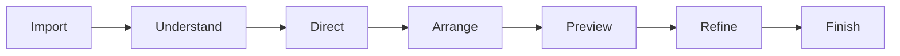
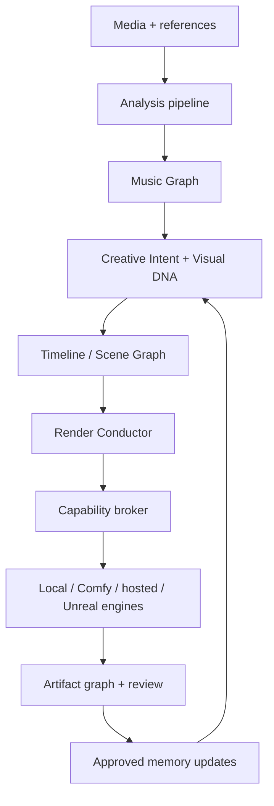
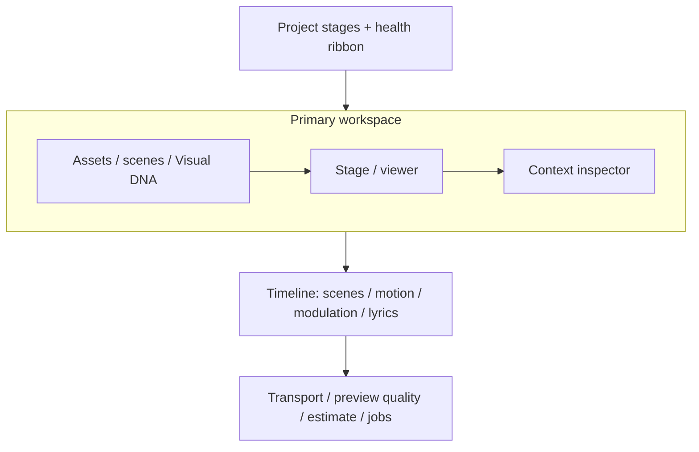

# DWCT Generative Sound Studio — Modernization Master Blueprint

**Prepared:** 2026-07-14  
**Repository:** [DWCTEDMG/DWCTGenerativeSoundStudio](https://github.com/DWCTEDMG/DWCTGenerativeSoundStudio)  
**Baseline:** `codex/Unified` at `6e2830c0634b939dcd8e0851fc0a17db66a4a132`  
**Purpose:** A product, experience, creative-technology, AI-model, engineering, release, and community plan that can be executed in the Codex desktop app.

---

## 1. Executive recommendation

Build **the adaptive music-video studio**: a local-first desktop product that understands a song as musical structure, lets a creator direct that structure visually, and allocates the right rendering engine to each shot.

The right sequence is:

1. **Stabilize the professional desktop foundation.** Make CI green, protect project data, repair the job system, split the largest modules, and make preview/render behavior deterministic.
2. **Productize the intelligence already taking shape.** Turn Visual DNA and Render Conductor from scaffolds into first-class, inspectable, editable parts of the workflow.
3. **Add selective model innovation behind a capability broker.** Models are replaceable engines, not the product architecture. Promote models only after compatibility, licensing, quality, speed, memory, and determinism gates pass.
4. **Expand into live and world-building workflows only after the core is trustworthy.** Unreal, OSC/MIDI/DMX, real-time visuals, and a template ecosystem belong in a Labs-to-Pro progression.

The near-term product promise should be:

> **Import a track. Direct its visual grammar. Preview instantly. Spend quality only where it matters. Finish a coherent music video without rebuilding the project for every model.**

This is deliberately not a rewrite. It is a staged conversion of the current modular-monolith desktop app into a dependable creative platform.

---

## 2. What the repository says today

### Strengths to preserve

- A meaningful Electron + React + Python desktop product already exists, with a DAW-like timeline, audio analysis, Deforum scheduling, internal rendering, model management, Visual DNA, Render Conductor, and Unreal/Forge experiments.
- The internal renderer is already treated as a canonical path. Preserve this single-source-of-truth behavior while extracting modules around it.
- Recent work is moving in the right direction: camera motion, beat-aware timeline editing, visual continuity, and security hardening.
- The repository has a substantial test base: roughly 64 Python test files and 24 UI test files at the inspected baseline.
- CodeQL default setup succeeds, and there are contribution guides, architecture decision records, and issue templates.

### Immediate constraints

- ~~The default-branch Studio workflow is red~~ — FFmpeg CI provisioning addressed (WP-01); re-verify on current Actions.
- `app.py` remains large, but System readiness and Project durability routes are extracted to `api/routers.py` (WP-09 started).
- ~~The current JSON job store is not a durable queue~~ — SQLite `JobStore` with leases/events/idempotency is in place (WP-05); JSON mirrors remain for compatibility.
- Timeline undo/redo and crash recovery foundations landed (WP-06 / WP-10 partial); full command coverage for move/trim/split still incomplete.
- The model catalog mixes recommended, fallback, optional, and community entries without a sufficiently strong promotion policy, pinned provenance, or hardware benchmark evidence.
- ~~Python dependencies without a committed lockfile~~ — uv + `uv.lock` on this branch (UV-01–04 largely done).
- `prepare-release-bundle.mjs` should continue to prove frozen packaging on release builds (UV-04).
- The default branch is a development branch and there is no visible PR history. A stable release lane and required review/check policy are needed.
- ~~Root hygiene gaps~~ — `LICENSE`, `SECURITY.md`, `CHANGELOG.md`, and `.env.example` added (P0-03).

### Working interpretation

The app has more feature surface than operational spine. The next major gain will not come from adding another model button. It will come from unifying the control model, project data, planning, job execution, review loop, and release discipline.

---

## 3. Three materially different product directions

Creative Engineering calls for genuinely different options before convergence. These are not themes for the same UI; they imply different products.

### Direction A — Professional local desktop studio

**Thesis:** Become the most dependable local-first DAW-like music-video tool for technically confident creators.

**Signature experience**

- Import music, inspect waveform/stems/sections, arrange shots, edit camera and modulation lanes, render locally, and export a complete package.
- Prioritize speed, predictable controls, privacy, project portability, and offline use.

**Advantages**

- Closest to the current product.
- Lowest execution and support risk.
- Builds trust with professional users.
- Creates the stable base every other direction needs.

**Risks**

- Can feel like a collection of advanced controls rather than a new creative category.
- Competes with general-purpose editors and node tools on reliability and ergonomics.

### Direction B — Adaptive music-video copilot — recommended product direction

**Thesis:** The studio should understand musical form and maintain visual intent across multiple engines, while leaving final authorship with the creator.

**Signature experience**

- The user chooses a director mode and describes the visual world.
- The app derives a Music Graph, proposes scene structure, motion grammar, continuity anchors, hero moments, and a render budget.
- The user edits an inspectable plan, previews with fast engines, and promotes selected shots to higher-quality engines.
- Approval/rejection and manual edits update project Visual DNA without silently changing the current timeline.

**Advantages**

- Makes Visual DNA and Render Conductor a defensible product system.
- Separates creative intent from changing model implementations.
- Uses expensive generation selectively.
- Serves beginners without removing depth from advanced users.

**Risks**

- Requires disciplined data contracts and confidence-aware suggestions.
- Bad automation would erode trust; every plan needs explanation and override.

### Direction C — Music-to-world performance platform

**Thesis:** Treat a song project as a reusable audiovisual world that can render a video, drive a live show, power an installation, or become an Unreal scene.

**Signature experience**

- The same cue graph drives offline shots and real-time outputs.
- Scenes expose OSC, MIDI, DMX, TouchDesigner, Unreal, and WebSocket mappings.
- Creators package scene systems, visual instruments, performers, and templates for reuse.

**Advantages**

- Long-term category expansion and ecosystem potential.
- Makes current Unreal and Forge work strategically meaningful.
- Connects finished videos, live performance, and interactive media.

**Risks**

- Highest integration, QA, and support surface.
- Real-time guarantees conflict with heavy generative workflows.
- Would diffuse the product before core editing and rendering are dependable.

### Convergence decision

Use **Direction A as the foundation**, **Direction B as the product**, and **Direction C as the experimental expansion lane**. Execute all three during the same seven-day build, but protect the stable path with explicit capability flags and provider boundaries.

| One-week lane | Product emphasis | Integration rule |
|---|---|---|
| Core | Reliable professional desktop | No feature may bypass project, job, provenance, or test contracts |
| Intelligence | Adaptive music-video copilot | Every proposal remains inspectable, editable, reversible, and attributable |
| Expansion | Music-to-world capabilities | Live/Unreal/adaptor work ships behind explicit experimental flags until its evidence gates pass |

---

## 4. Product principles and non-goals

### Principles

1. **Music structure, not raw amplitude, drives direction.** Beats matter, but phrases, sections, energy arcs, lyrics, stems, and contrast matter more.
2. **Intent is stable; engines are replaceable.** User-facing scene intent must not be a thin wrapper around one model's parameters.
3. **Preview and final are the same plan at different quality levels.** Do not make users rebuild work for final rendering.
4. **The machine proposes; the creator approves.** Plans and learned preferences must be visible, attributable, and reversible.
5. **Continuity is a project asset.** Subjects, environments, palettes, lenses, seed lineage, and reference frames belong in project data.
6. **Every artifact has provenance.** A frame or clip should record input assets, plan revision, engine, model revision, parameters, seed, and code version.
7. **Local-first does not mean local-only.** Cloud and remote compute are providers behind the same capability contract.
8. **Graceful degradation is a feature.** Missing GPU, FFmpeg, model, token, or network should produce a usable alternate lane and a clear explanation.

### Non-goals during the modernization build

- Do not replace the whole backend framework.
- Do not replace every existing state-management approach at once.
- Do not add a general node editor before the main workflow is coherent.
- Do not make an experimental 20B+ model the default local experience.
- Do not build a marketplace before packages are versioned, permissioned, and reproducible.
- Do not promise real-time generation from engines that cannot meet a declared latency budget.

---

## 5. North-star experience

### The seven-stage creator flow



1. **Import** — audio, lyrics, reference images/video, brand or character assets.
2. **Understand** — inspect beat grid, sections, stems, lyrics, mood tags, confidence, and detected musical arc.
3. **Direct** — select a director mode, define world, continuity anchors, motion character, and render budget.
4. **Arrange** — accept/edit a proposed scene map in the timeline; author keyframes and modulation lanes.
5. **Preview** — render low-cost proxies for every scene with the same framing and timing contract intended for final.
6. **Refine** — compare variants, lock strong frames, edit prompts or controls, and promote hero shots.
7. **Finish** — render through mixed engines, assemble, grade, validate audio sync, and export deliverables plus manifest.

### Director modes

Director modes should be strategy presets, not magic prompt suffixes.

| Mode | Structural behavior | Default visual behavior |
|---|---|---|
| Narrative | Sections become story beats and continuity states | Establishing, development, reversal, resolution |
| Performance | Lyrics/phrasing and performer identity dominate | Coverage grammar, lip/performance emphasis, hero closeups |
| Abstract | Timbre, harmony, and energy drive visual fields | Motif evolution, texture, color, controlled transformation |
| Lyric | Word timing and typography are first-class | Readable kinetic type, semantic reveals, emphasis hierarchy |
| Product | Claims, assets, and brand rules constrain generation | Product continuity, controlled camera, clean negative space |
| Ambient | Long phrases and slow envelopes dominate | Minimal cuts, environmental continuity, restrained motion |

Each mode owns a documented set of proposal rules, validation rules, and UI defaults. The creator can mix modes by scene.

---

## 6. System blueprint

### End-to-end architecture



### Architectural rule

There are four independent layers:

1. **Generation:** creates audio analysis, images, clips, masks, depth, motion, or scene proposals.
2. **Modulation:** maps musical signals and authored envelopes into bounded parameters.
3. **Transitions:** manages cuts, first/last-frame bridges, match cuts, dissolves, interpolation, and continuity between scenes.
4. **Output routing:** decides proxy/final engine, compute target, assembly, encoding, and delivery.

No renderer should be allowed to collapse all four layers into an opaque route.

### Target modular-monolith domains

```text
python_backend/edmg_studio_backend/
  api/
    projects.py
    analysis.py
    timeline.py
    renders.py
    models.py
    system.py
  domain/
    music_graph/
    creative_intent/
    visual_dna/
    scene_graph/
    render_plans/
    artifacts/
  services/
    analysis/
    conductor/
    renderer/
    review/
    providers/
  infrastructure/
    database/
    filesystem/
    ffmpeg/
    model_store/
    telemetry/
  workers/
    scheduler.py
    executor.py
    recovery.py
```

```text
studio/edmg-studio/src/
  app/
  features/
    project/
    analysis/
    director/
    timeline/
    render-lab/
    review/
    models/
    system/
  entities/
    music-graph/
    scene/
    render-plan/
    artifact/
  shared/
    api/
    components/
    commands/
    state/
    validation/
```

Keep one deployable desktop application initially. Create enforceable domain boundaries before considering separate services.

---

## 7. Canonical data blueprints

All stored documents need `schema_version`, `created_at`, `updated_at`, stable IDs, migrations, and atomic writes. Store user intent separately from derived or cached output.

### Music Graph

The Music Graph is the canonical time-aware description shared by the analyzer, timeline, director, render planner, and live adapters.

```ts
type MusicGraph = {
  schemaVersion: "1.0";
  source: AudioAssetRef;
  timebase: { sampleRate: number; fpsHint?: number; durationSeconds: number };
  tempo: { bpm: number; confidence: number; variableTempo?: TempoPoint[] };
  meter: { numerator: number; denominator: number; confidence: number };
  beats: TimedEvent[];
  bars: TimedRange[];
  sections: Array<TimedRange & { label: string; confidence: number }>;
  stems: Array<{ kind: string; asset?: AssetRef; features: FeatureCurves }>;
  lyrics?: { language?: string; words: TimedWord[]; lines: TimedRange[] };
  harmony?: { key?: string; chords?: TimedEvent[]; confidence: number };
  features: {
    loudness: CurveRef;
    onsetStrength: CurveRef;
    spectralFlux: CurveRef;
    brightness: CurveRef;
    harmonicity: CurveRef;
    energyArc: CurveRef;
  };
  semantics?: { tags: WeightedTag[]; sectionTags?: Record<string, WeightedTag[]> };
  analysisRuns: AnalysisProvenance[];
};
```

### Creative Intent

```ts
type CreativeIntent = {
  schemaVersion: "1.0";
  directorMode: "narrative" | "performance" | "abstract" | "lyric" | "product" | "ambient";
  concept: string;
  audience?: string;
  aspectRatios: string[];
  world: WorldBible;
  continuity: ContinuityAnchor[];
  visualGrammar: {
    palette: string[];
    texture: string[];
    lenses: string[];
    compositionRules: string[];
    motionCharacter: string[];
    forbiddenTraits: string[];
  };
  budget: { priority: "speed" | "balanced" | "quality"; maxComputeMinutes?: number; maxCost?: number };
  accessibility?: { avoidFlashesAboveHz?: number; safeTextZones?: boolean };
};
```

### Scene intent and timeline

User-visible scene intent remains engine-neutral.

```ts
type SceneIntent = {
  id: string;
  range: { start: number; end: number };
  role: "establish" | "develop" | "contrast" | "hero" | "transition" | "resolve";
  subject: string[];
  environment: string[];
  action: string[];
  framing: FramingIntent;
  motion: MotionPhrase[];
  continuityRefs: string[];
  musicBindings: ModulationBinding[];
  qualityPriority: number;
  locks: Array<"timing" | "subject" | "camera" | "reference" | "engine">;
};
```

### Render Plan

The Render Conductor compiles intent into a versioned, inspectable job DAG.

```ts
type RenderPlan = {
  id: string;
  revision: number;
  intentRevision: string;
  projectRevision: string;
  tasks: RenderTask[];
  dependencies: Array<{ from: string; to: string }>;
  allocations: Array<{
    taskId: string;
    capability: CapabilityRequirement;
    preferredProvider?: string;
    fallbacks: string[];
  }>;
  estimates: { seconds: number; vramGb?: number; diskGb: number; cost?: number };
  warnings: PlanWarning[];
};
```

### Artifact manifest

Every generated output gets a sidecar manifest:

- content hash and relative project path;
- source asset hashes;
- scene, plan, and project revisions;
- engine/provider/model repository and immutable model revision;
- runtime/package versions;
- prompt/control inputs and seed;
- hardware summary and elapsed time;
- safety/license metadata;
- parent/child artifact lineage;
- review state and approved Visual DNA updates.

This enables reproducibility, cache reuse, regression testing, provenance views, and safe cleanup.

---

## 8. Audio intelligence and synchronization blueprint

### Two-layer analysis

**Deterministic signal layer**

- Decode, channel handling, sample-rate normalization, loudness, peaks, silence.
- Tempo, beat, downbeat, meter, onset, bar and phrase estimates.
- Spectral features, chroma, harmonic/percussive balance, energy, brightness.
- Source separation where enabled, with explicit quality and compute status.
- Cache every stage by source hash + algorithm version + parameters.

**Learned semantic layer**

- Audio/text embeddings for mood, instrumentation, scene retrieval, and prompt assistance.
- Speech/lyric transcription with word timestamps and language confidence.
- Optional structure or tag classifiers.
- Learned results are additive and confidence-bearing; deterministic analysis remains available offline.

### Use musical timescales, not one signal

| Timescale | Examples | Best visual uses |
|---|---|---|
| Fast: 20–250 ms | onsets, transients, consonants | particles, brief light accents, micro-cuts with rate limits |
| Medium: 0.25–4 s | beats, bars, lyric lines, phrases | camera impulses, gestures, typography, local transitions |
| Slow: 4–60 s | sections, energy arc, harmony, narrative state | scene selection, palette, environment, shot scale, quality budget |

### Modulation contract

Every music-to-visual mapping must declare:

- source signal and confidence;
- normalization and calibration window;
- smoothing, attack, release, and hysteresis;
- min/max range and nonlinear response curve;
- rate limit and saturation behavior;
- combination rule with authored animation;
- preview/final determinism;
- accessibility cap where relevant.

Authored control is the base. Musical modulation is a bounded layer on top. A creator must be able to freeze, mute, scale, or bake each mapping.

### Motion grammar

Do not map every beat to a camera move. Compose motion into phrases:

- **Prepare:** gentle drift or anticipation before a musical event.
- **Accent:** brief impulse at the event.
- **Travel:** sustained camera or scene motion across a phrase.
- **Settle:** damping and visual rest.
- **Contrast:** a deliberate grammar change at section boundaries.

Motion phrases should be shown in lanes and compiled into renderer-specific schedules. This makes motion musical without becoming jittery.

---

## 9. Creative feature blueprint

### 9.1 Music Genome view

A readable overview of the song's structure: sections, energy arc, stems, lyric density, harmonic changes, and confidence. It is both an analysis editor and the source of timeline snapping.

**Why it matters:** users can correct the machine once and improve every downstream proposal.

### 9.2 Visual DNA as project memory

Promote Visual DNA from hidden memory to an inspectable project panel:

- identity cards for characters, objects, products, and environments;
- palette, material, lens, composition, motion, and typography traits;
- reference frame board and seed lineage;
- accepted/rejected traits with evidence;
- engine-specific lessons separated from engine-neutral intent;
- explicit `Apply to project` action for learned changes.

### 9.3 Hero Shot Engine

Rank moments using section role, energy contrast, lyric salience, creator markers, and scene priority. Allocate slow/high-quality generation only to top moments; use fast lanes elsewhere. Show the budget impact before execution.

### 9.4 Variant lanes and review

- Render two to four variants for a scene under one plan revision.
- Compare synchronized video, first/last frames, timing, cost, and provenance.
- Approve whole variant or cherry-pick reference frame, motion, palette, or prompt traits.
- Preserve rejected artifacts until the user closes the review or cleanup policy expires.

### 9.5 Continuity anchors

- First/last-frame contracts between adjacent scenes.
- Character and product identity cards.
- Environment and lighting state.
- Camera side, lens family, shot scale, and screen direction.
- Prompt and negative-prompt anchors.
- Reference weighting and seed lineage.

Continuity failures should appear as plan warnings before a costly render.

### 9.6 Semantic match-cut designer

Suggest transitions based on composition, motion direction, color mass, subject geometry, lyric meaning, and musical boundaries. Suggestions produce editable transition tasks; they never overwrite clips.

### 9.7 Stem-aware modulation matrix

Rows are musical sources; columns are visual targets. Cells show mapping strength, smoothing, range, and lane ownership. Presets such as `Kick → scale pulse`, `Vocal → focal emphasis`, or `Pad → environmental drift` are starting points, not permanent black boxes.

### 9.8 Music-reactive typography

Treat lyric words and title cards as timeline objects with readability constraints, safe areas, semantic emphasis, and export-resolution validation. Provide restrained presets before experimental kinetic type.

### 9.9 Smart render budget

A three-axis control—time, local memory, and monetary cost—updates the Render Plan. The app explains which scenes change engine, resolution, steps, variants, or upscaling.

### 9.10 Live Visual Set — Labs

Compile selected Music Graph events and modulation lanes into a stable real-time cue stream for OSC, MIDI, WebSocket, DMX, TouchDesigner, or Unreal. Heavy generation remains precomputed; real-time systems manipulate approved assets and parameters within declared latency limits.

---

## 10. UX and visual design blueprint

### Information architecture

| Space | Primary question | Key surfaces |
|---|---|---|
| Home | What am I working on? | Recent projects, templates, recovery, system readiness |
| Understand | What is happening in the music? | Music Genome, lyrics, stems, analysis corrections |
| Director | What visual world and grammar should this follow? | Concept, modes, Visual DNA, references, proposal controls |
| Timeline | What happens when? | scenes, clips, keyframes, modulation, transitions, markers |
| Render Lab | How will it be made? | plan graph, model/provider allocation, budget, queue |
| Review | Which result should survive? | synchronized variants, notes, locks, provenance |
| Models | What capabilities are installed? | stable/experimental lanes, licenses, storage, benchmarks |
| System | Can this machine finish the job? | FFmpeg/GPU/disk/runtime diagnostics, logs, recovery |

### Main studio shell



### Interaction model

- **Simple mode:** intent, scene structure, essential motion, preview, review, finish.
- **Advanced mode:** full schedules, model overrides, modulation matrix, task graph, manifests.
- Both modes edit the same canonical data; switching does not fork the project.
- Selection drives one contextual inspector. Avoid multiple modal editors for the same scene.
- Long actions produce persistent jobs with pause/cancel/retry/open-log behavior.
- Destructive or expensive actions show affected scenes, estimated cost, and cache impact.
- Every AI proposal includes source evidence: music event, Visual DNA trait, selected mode, or prior approval.

### Visual system direction

Choose a **quiet technical cinema** language:

- Near-black neutral canvas with one restrained accent family and semantic status colors.
- High information density in the timeline; generous space in Director and Review.
- Typography optimized for numeric scanning and long sessions.
- Motion communicates state change and hierarchy, not decoration.
- Waveforms, curve editors, task graphs, and provenance use consistent colors and selection semantics.
- WCAG-aware contrast, keyboard operation, scalable text, visible focus, reduced motion, and flash-frequency warnings are release requirements.

### First-run experience

1. Run system readiness: FFmpeg, GPU/provider, disk, writable project location.
2. Offer `Local Starter`, `Balanced`, and `External Compute` profiles.
3. Create a 30-second guided project using bundled lightweight fixtures—not a multi-gigabyte download.
4. Explain model licenses and storage before installation.
5. Finish with a rendered proxy and a clear path to higher quality.

---

## 11. Hugging Face model and runtime strategy

### Policy before catalog

Model support must be manifest-driven. Each entry needs:

- exact Hugging Face repository and immutable revision;
- task/capability contract;
- upstream license identifier, acceptance requirements, and commercial-use note;
- expected download size, peak disk, RAM, VRAM, and supported precision/quantization;
- runtime and package version range;
- supported operating systems and GPU backends;
- deterministic seed behavior and known limitations;
- minimum quality/speed benchmark result on named hardware;
- promotion lane: `stable`, `recommended`, `experimental`, or `research`;
- verified fallback.

Never silently update a model revision inside an existing project. New revisions are opt-in migrations with re-benchmarking.

### Proposed 2026 catalog

| Capability | Candidate | Lane | Recommendation |
|---|---|---|---|
| Balanced local text/image-to-video | [Wan-AI/Wan2.2-TI2V-5B-Diffusers](https://huggingface.co/Wan-AI/Wan2.2-TI2V-5B-Diffusers) | Recommended | Retain as the quality-oriented default after platform benchmarks; Apache-2.0 |
| Higher-end text-to-video | [Wan-AI/Wan2.2-T2V-A14B-Diffusers](https://huggingface.co/Wan-AI/Wan2.2-T2V-A14B-Diffusers) | Experimental | Offer only where hardware/provider meets declared requirements |
| Audio-driven performance video | [Wan-AI/Wan2.2-S2V-14B](https://huggingface.co/Wan-AI/Wan2.2-S2V-14B) | Experimental external/high-end | Strong performer lane; upstream example targets very high VRAM, so not a normal desktop default |
| Fast Wan previews | [lightx2v/Wan2.2-Distill-Loras](https://huggingface.co/lightx2v/Wan2.2-Distill-Loras) | Benchmark candidate | Test for proxy consistency, motion quality, and license/provenance before promotion |
| Joint audio-video generation | [Lightricks/LTX-2.3](https://huggingface.co/Lightricks/LTX-2.3) | Research → Experimental | High-potential hero-shot engine; current card describes its own runtime and upcoming Diffusers support. Review community license and runtime isolation first |
| Legacy short image-to-video | [stabilityai/stable-video-diffusion-img2vid-xt](https://huggingface.co/stabilityai/stable-video-diffusion-img2vid-xt) | Legacy | Keep project compatibility; demote from prominent discovery when a better fast lane passes benchmarks |
| Older optional video path | [zai-org/CogVideoX-5b](https://huggingface.co/zai-org/CogVideoX-5b) | Compatibility | Update stale owner references, pin revisions, and keep only if regression evidence justifies support |
| Semantic audio embeddings | [laion/clap-htsat-fused](https://huggingface.co/laion/clap-htsat-fused) | Recommended analysis option | Add mood/instrument/semantic tags and reference retrieval; cache embeddings and expose confidence |
| Multilingual timestamped ASR | [nvidia/parakeet-tdt-0.6b-v3](https://huggingface.co/nvidia/parakeet-tdt-0.6b-v3) | Experimental analysis option | Benchmark installation and runtime per OS; retain a smaller, proven transcription fallback |
| Controlled video-to-video | [Wan-AI/Wan2.1-VACE-14B](https://huggingface.co/Wan-AI/Wan2.1-VACE-14B) | Research | Explore for continuity/control tasks after core plan contracts are stable |
| Video continuation | [meituan-longcat/LongCat-Video](https://huggingface.co/meituan-longcat/LongCat-Video) | Research | Evaluate specifically for scene extension and continuity, not as a generic default |

### Runtime lanes

1. **CPU/lightweight lane:** analysis, planning, thumbnails, waveform, project validation.
2. **Local fast lane:** proxy images/clips, low resolution, few steps, distilled adapters where validated.
3. **Local quality lane:** supported GPU generation with resource reservation and pause/recovery.
4. **Managed node lane:** ComfyUI or other local service through a versioned workflow adapter.
5. **External provider lane:** remote GPU or hosted API, with explicit upload scope, cost, retention, and cancellation.
6. **Real-time lane:** precomputed assets plus bounded live modulation; it must never wait on a slow diffusion task.

### Benchmark gate

Every candidate must pass a checked-in benchmark suite:

- install and cold-start reliability;
- 5–10 second representative shot at fixed conditions;
- peak RAM/VRAM/disk and elapsed time;
- first/last-frame adherence;
- camera/motion adherence;
- temporal consistency and identity drift;
- seed repeatability;
- cancellation and out-of-memory recovery;
- offline behavior after install;
- license display and model-card attribution;
- Windows, Ubuntu, and supported macOS lane where applicable.

Publish results as machine-readable JSON plus a human summary. Catalog promotion requires evidence, not popularity.

---

## 12. Render Conductor blueprint

### Responsibilities

The Conductor should:

- compile project intent and timeline into tasks;
- validate missing assets, continuity conflicts, unsafe settings, and unsupported capabilities;
- choose capability lanes according to quality, latency, memory, cost, and privacy;
- reserve resources and order tasks as a DAG;
- reuse cache by content hash;
- support pause, cancel, retry, resume, fallback, and partial completion;
- estimate cost before remote execution;
- emit a complete artifact manifest;
- never mutate the authored timeline during execution.

### Capability broker

Providers declare capabilities rather than brand names:

```ts
type Capability = {
  media: "image" | "video" | "audio" | "mask" | "depth" | "scene";
  operation: "generate" | "transform" | "extend" | "upscale" | "interpolate" | "assemble";
  controls: Array<"text" | "image" | "first_frame" | "last_frame" | "audio" | "pose" | "depth" | "mask">;
  maxDuration?: number;
  resolutions: string[];
  deterministic: boolean;
  supportsCancel: boolean;
  locality: "in_process" | "local_service" | "remote";
};
```

The UI may show the selected engine, but plans should express why it was selected and which fallbacks remain valid.

### Durable job system

Replace loose JSON queue semantics with SQLite in WAL mode:

- tables for jobs, task attempts, leases, dependencies, events, artifacts, and logs;
- FIFO priority ordering using high-resolution timestamps and explicit priority;
- atomic claim with lease expiry;
- heartbeat and orphan recovery;
- idempotency key per plan task;
- append-only state transition events;
- process restart and machine reboot recovery;
- bounded log retention and redaction;
- one scheduler authority, multiple optional executors later.

JSON project documents can remain project-facing; execution state belongs in a transactional store.

---

## 13. Engineering modernization plan

### Python toolchain — recommended full `uv` integration

Adopt [Astral `uv`](https://github.com/astral-sh/uv) as the single Python environment, resolution, lock, execution, test, and release-build tool. Keep **pnpm** as the JavaScript/Electron package manager. The correct monorepo toolchain is:

- `pnpm` for React, Electron, Director, Node scripts, and electron-builder;
- `uv` for Python acquisition, project environments, dependency resolution, locking, tests, linting, backend execution, and PyInstaller builds.

Do not copy or vendor the `uv` repository into this project. Install a pinned released `uv` binary or pinned `astral-sh/setup-uv` action and integrate its project interface.

#### Required end state

1. Add a repository `.python-version` containing Python `3.12` and change the backend requirement to `>=3.12,<3.13` so development, CI, PyInstaller, and release builds use the same interpreter family.
2. Generate and commit `studio/edmg-studio/python_backend/uv.lock`. Treat this universal lockfile as release input and never hand-edit it. Astral documents `uv.lock` as a portable cross-platform record of exact resolutions intended for version control and reproducible application deployment: [uv lockfile documentation](https://github.com/astral-sh/uv/blob/2937610e418bf5bb8e8922f5c935e67215d4f8c1/docs/concepts/projects/layout.md#the-lockfile).
3. Preserve base product features as ordinary project dependencies or feature extras, but replace overlapping `studio_bundle*` dependency duplication with three mutually exclusive accelerator profiles: `cpu`, `directml`, and `cuda`.
4. Configure explicit PyTorch indexes under `[[tool.uv.index]]` and route only Torch-family packages through them with `explicit = true` and `[tool.uv.sources]`. This follows Astral's [PyTorch integration guidance](https://github.com/astral-sh/uv/blob/2937610e418bf5bb8e8922f5c935e67215d4f8c1/docs/guides/integration/pytorch.md).
5. Declare accelerator profiles incompatible through `tool.uv.conflicts`; exactly one accelerator profile may be synchronized into an environment.
6. Move PyInstaller and packaging-only tools to a `build` dependency group, pytest/httpx to `test`, Ruff to `lint`, and shared contributor tools to `dev`. Runtime packages must not depend on test or build tooling.
7. Update root and Studio launchers, setup wizard, backend setup scripts, pytest scope runner, developer documentation, CI, model tests, and release packaging to execute through `uv`.
8. Use `uv lock --check` followed by `uv sync --frozen` in CI and release builds. `--frozen` ensures those jobs consume the committed lockfile rather than resolving a new environment; Astral documents the exact locking and syncing behavior in [Locking and syncing](https://github.com/astral-sh/uv/blob/2937610e418bf5bb8e8922f5c935e67215d4f8c1/docs/concepts/projects/sync.md).
9. Keep packaged end-user binaries self-contained. `uv` is a source, CI, and build dependency; a user launching the PyInstaller backend from the installed Electron application should not need `uv` or Python.

#### Target dependency topology

The exact locked versions and supported CUDA channel must be selected by the compatibility matrix, but the `pyproject.toml` should converge on this shape:

```toml
[project]
requires-python = ">=3.12,<3.13"

[project.optional-dependencies]
cpu = ["torch", "torchvision", "torchaudio"]
directml = [
  "torch",
  "torchvision",
  "torchaudio",
  "onnxruntime-directml; platform_system == 'Windows'",
  "optimum[onnxruntime]; platform_system == 'Windows'",
]
cuda = [
  "torch",
  "torchvision",
  "torchaudio",
  "cuda-python",
  "tensorrt",
]

[dependency-groups]
test = ["pytest", "httpx"]
lint = ["ruff"]
build = ["pyinstaller", "wheel", "setuptools<82"]
dev = [
  { include-group = "test" },
  { include-group = "lint" },
]

[tool.uv]
conflicts = [
  [{ extra = "cpu" }, { extra = "directml" }],
  [{ extra = "cpu" }, { extra = "cuda" }],
  [{ extra = "directml" }, { extra = "cuda" }],
]

[tool.uv.sources]
torch = [
  { index = "pytorch-cpu", extra = "cpu" },
  { index = "pytorch-cpu", extra = "directml" },
  { index = "pytorch-cuda", extra = "cuda" },
]
torchvision = [
  { index = "pytorch-cpu", extra = "cpu" },
  { index = "pytorch-cpu", extra = "directml" },
  { index = "pytorch-cuda", extra = "cuda" },
]
torchaudio = [
  { index = "pytorch-cpu", extra = "cpu" },
  { index = "pytorch-cpu", extra = "directml" },
  { index = "pytorch-cuda", extra = "cuda" },
]

[[tool.uv.index]]
name = "pytorch-cpu"
url = "https://download.pytorch.org/whl/cpu"
explicit = true

[[tool.uv.index]]
name = "pytorch-cuda"
url = "https://download.pytorch.org/whl/<validated-cuda-channel>"
explicit = true
```

The DirectML profile uses the CPU PyTorch index for Torch-family packages and adds the validated Windows DirectML/ONNX stack. Do not assume `torch-directml` compatibility; add it only after its Python 3.12, Torch, model, and packaging matrix passes. The CUDA URL must be a fixed release-supported channel encoded in the lock, not the current dynamically supplied arbitrary index URL.

Keep capability extras such as `audio`, `asr`, `source-separation`, `parakeet`, cloud providers, and internal video separate from accelerator choice. A supported product environment composes product capabilities with exactly one accelerator profile.

#### Two-stage migration inside the seven-day build

**Stage 1 — low-risk `uv pip` replacement and inventory**

- Pin the `uv` version used by local scripts and CI.
- Add Python 3.12 `.python-version` and verify every current dependency on Windows and Ubuntu.
- Replace direct `python -m pip` calls with equivalent `uv pip` commands while keeping current extras and requirements files temporarily intact.
- Inventory every environment creator and installer: root/Studio launchers, setup wizard, backend scripts, cloud bootstraps, pytest runner, CI, and release bundler.
- Record current CPU, DirectML, and CUDA resolution graphs as migration fixtures.
- Run current tests and build the current PyInstaller artifact to prove behavioral parity.

**Stage 2 — project lock, accelerator profiles, and release unification**

- Refactor `pyproject.toml` into base dependencies, capability extras, mutually exclusive accelerator extras, and dependency groups.
- Add explicit Torch sources/indexes and conflicts, generate `uv.lock`, and commit it with a lock-update policy.
- Convert all normal invocations to `uv sync`, `uv run`, and `uv lock`; remove direct pip installation from supported paths.
- Make `requirements-internal.txt` and `requirements-directml.txt` either generated compatibility exports from `uv.lock` or remove them after every consumer migrates. They must not remain independent sources of truth.
- Update source launchers to detect/install a pinned `uv` safely, synchronize the selected frozen profile, and use `uv run`. Preserve the packaged-binary fast path.
- Update the setup UI to display Python version, uv version, lock hash, active accelerator profile, Torch build/index, and sync health.
- Update documentation and troubleshooting commands for CPU, DirectML, and CUDA.

#### Canonical commands

```shell
# Developer CPU environment
uv lock --check
uv sync --frozen --extra cpu --group test --group lint
uv run --frozen --extra cpu --group test pytest
uv run --frozen --extra cpu --group lint ruff check .

# Windows DirectML build environment
uv lock --check
uv sync --frozen --extra directml --group build
uv run --frozen --extra directml --group build pyinstaller pyinstaller.spec --clean --noconfirm

# CUDA build environment, using the fixed index/profile encoded in pyproject + uv.lock
uv lock --check
uv sync --frozen --extra cuda --group build
uv run --frozen --extra cuda --group build pyinstaller pyinstaller.spec --clean --noconfirm
```

Use the actual backend working directory or `--project studio/edmg-studio/python_backend` consistently in root-level scripts. Do not rely on whichever directory a user happened to launch from.

#### Release-bundle migration — mandatory

`studio/edmg-studio/scripts/prepare-release-bundle.mjs` must migrate in the same change set as CI. Its current behavior creates a `venv`, upgrades pip/wheel/setuptools, installs an optionally selected Torch stack, installs a Studio bundle extra, and installs PyInstaller. Replace that resolution path with:

1. resolve `uv` and verify the pinned tool and Python 3.12;
2. map `EDMG_BACKEND_ACCELERATOR_PROFILE` to exactly `cpu`, `directml`, or `cuda`;
3. run `uv lock --check`;
4. run `uv sync --frozen --extra <profile> --group build`;
5. invoke PyInstaller through `uv run --frozen --extra <profile> --group build`;
6. reject arbitrary Torch index injection in production builds;
7. include `.python-version`, `pyproject.toml`, and `uv.lock` in the backend source fingerprint;
8. record the uv version, Python version, lockfile SHA-256, accelerator profile, resolved Torch versions/index, and PyInstaller version in `backend-bundle-manifest.json`.

This is the decisive reproducibility rule: development, CI, and packaged release builds must consume the same project metadata and committed lockfile. Updating only README commands or developer setup would leave the highest-risk path unresolved.

#### CI and release matrix

| Lane | Required command pattern | Purpose |
|---|---|---|
| Windows CPU | `uv sync --frozen --extra cpu --group test --group lint` | deterministic baseline and backend tests |
| Ubuntu CPU | `uv sync --frozen --extra cpu --group test --group lint` | deterministic baseline and backend tests |
| Windows DirectML | `uv sync --frozen --extra directml --group test` | DirectML import, provider, model, and packaging smoke tests |
| CUDA runner | `uv sync --frozen --extra cuda --group test` | scheduled/manual GPU compatibility and model benchmarks |
| Release CPU/DirectML/CUDA | `uv sync --frozen --extra <profile> --group build` | PyInstaller artifact from the exact committed resolution |

Cache the uv download/package cache using the committed lockfile as part of the key; never cache and reuse an untracked environment as release truth. CI must fail if `uv lock --check` reports drift or if any supported script still performs a direct unconstrained pip install.

#### Lock maintenance policy

- Normal CI and release jobs never modify `uv.lock`.
- Dependency changes update `pyproject.toml` and `uv.lock` in the same reviewed pull request.
- Scheduled updates use `uv lock --upgrade` or targeted `uv lock --upgrade-package <name>` and publish before/after test and model benchmark evidence.
- Torch, diffusers, transformers, accelerate, ONNX Runtime, PyInstaller, and CUDA-related changes require the accelerator and packaging matrices.
- Export CycloneDX from the lock for the release SBOM and retain the lock hash in artifact provenance.
- Dependabot/Renovate suggestions do not bypass model/runtime compatibility review.

#### `uv` integration acceptance criteria

- `.python-version` pins Python 3.12 and every supported path rejects other interpreter families with a useful message.
- `uv.lock` is committed beside the backend `pyproject.toml` and `uv lock --check` passes.
- CPU, DirectML, and CUDA profiles resolve independently; any pair selected together fails clearly through declared conflicts.
- PyInstaller, pytest, httpx, and Ruff live in appropriate dependency groups rather than runtime extras.
- No supported developer, CI, launcher, setup, test, or release-build path performs an untracked dependency resolution.
- CI and release use `uv sync --frozen`; release manifests prove which lock and accelerator profile produced each artifact.
- Existing projects and installed packaged applications continue working; pnpm and the Electron build pipeline remain intact.

### Backend

- Create a small application factory and domain routers; extract routes from `app.py` by behavior, not line-count batches.
- Introduce service interfaces at side-effect boundaries: FFmpeg, filesystem, models, providers, queue, and clock.
- Generate OpenAPI and use a typed frontend client. Remove hand-maintained request/response drift.
- Use explicit Pydantic models for every persisted or public payload; forbid new untyped dictionaries at boundaries.
- Centralize error codes and map them to actionable UI recovery.
- Add project migration and validation commands before changing schemas.
- Make all output writes temp-file + fsync/close + atomic rename where supported.

### Frontend

- Extract page-local domains from `Render.tsx`, `Timeline.tsx`, and `Settings.tsx` into feature packages.
- Adopt a command model for timeline mutations: execute, undo, redo, serialize, and describe.
- Store durable project state separately from ephemeral viewer/UI state.
- Use reducers or state machines for multi-step analysis/render/review flows.
- Replace broad `any` usage first at API, timeline, render-plan, and IPC boundaries.
- Add selectors to avoid whole-timeline rerenders; virtualize track items and thumbnails.
- Standardize async states: idle, validating, queued, running, paused, retryable, blocked, complete, canceled.

### Electron and IPC

- Keep context isolation; expose minimal allowlisted IPC methods.
- Validate request and response schemas on both sides.
- Never pass arbitrary filesystem paths from renderer code without project-scope validation.
- Move secrets to OS credential storage and scrub them from logs/crash reports.
- Define a signed update channel only after packaging reproducibility and release rollback exist.

### Media and storage

- Use project-relative asset references plus a content-addressed cache.
- Maintain a project asset index with hashes, media probes, proxies, and reference counts.
- Separate originals, generated artifacts, proxies, analysis caches, and temporary task files.
- Provide `Project Health`, `Collect project`, `Relink missing`, `Clean cache`, and `Archive` operations.
- Validate disk space before task start and preserve originals during cleanup.

### Performance budgets

Establish measurable budgets:

- cold launch to usable project browser;
- project open for small/medium/large fixtures;
- timeline pan/zoom frame time;
- waveform and thumbnail cache hit rate;
- analysis time per audio minute;
- job claim latency and UI update rate;
- memory ceiling with no model loaded;
- cancellation latency for FFmpeg and model tasks.

Performance work without a fixture and budget does not count as complete.

---

## 14. Reliability, security, privacy, and responsible AI

### Reliability

- Make FFmpeg an explicit CI and first-run dependency with version detection.
- Add crash-safe autosave journals and recovery snapshots.
- Version project schemas and test forward migrations on fixture projects.
- Add deterministic golden fixtures for beat grid, schedules, scene compilation, and assembly metadata.
- Treat cancellation, low disk, missing files, corrupt media, OOM, provider timeout, and reboot as first-class tests.
- Keep the canonical internal renderer path and compare extracted modules against its golden outputs.

### Security

- Add `SECURITY.md`, supported-version policy, vulnerability reporting, and response expectations.
- Remove the committed root `.env`; provide `.env.example`, ignore real env files, and scan history/release artifacts for secrets.
- Pin GitHub Actions by full commit SHA and enable dependency update automation.
- Generate SBOMs for desktop releases and attach checksums/signatures.
- Sanitize filenames, archive extraction, workflow imports, model paths, and FFmpeg arguments.
- Apply allowlists and explicit permission prompts to external provider uploads and live-control endpoints.

### Privacy

- Default project, analysis, embeddings, and Visual DNA to local storage.
- Before external generation, show exactly which media, text, and metadata leave the device.
- Make telemetry opt-in, structured, minimal, and viewable.
- Provide one-click deletion of remote job references and local derived data where provider contracts allow.

### Responsible model use

- Surface upstream license and attribution before installation and export.
- Record model and revision in output manifests.
- Add configurable provenance metadata/watermark options without claiming universal detection.
- Provide safety controls appropriate to supported providers while keeping moderation events private and explainable.
- Avoid training or persistent preference learning from user content unless explicitly enabled.

---

## 15. Testing and release blueprint

### Test pyramid

| Layer | Purpose | Required additions |
|---|---|---|
| Contract/unit | Domain invariants and pure compilation | Music Graph, Creative Intent, motion grammar, conductor selection, migrations |
| Component | UI and service behavior | timeline commands, Director, Model Manager, review, failure recovery |
| Integration | Real boundaries | FFmpeg, SQLite leases, filesystem atomics, IPC schemas, provider stubs |
| End-to-end | Creator journeys | import → analyze → direct → preview → review → finish; crash recovery |
| Media golden | Semantic regression | beat/section fixture, schedule JSON, frame metadata, output duration/sync |
| GPU benchmark | Model compatibility | scheduled/manual matrix on named hardware, never a silent merge requirement |

### CI lanes

1. **PR fast lane:** `uv lock --check`, frozen CPU-profile sync, Ruff, pytest unit/contract tests, pnpm typecheck/lint/tests/build, schema checks, and dependency/security scan.
2. **PR media lane:** frozen CPU profile, FFmpeg integration, and small Electron end-to-end fixtures on Windows and Ubuntu; frozen DirectML smoke on Windows.
3. **Nightly extended lane:** larger project migration, frozen CPU/DirectML packaging tests, cache/recovery, and frozen CUDA model benchmarks on a GPU runner.
4. **Release lane:** `uv sync --frozen` with the selected accelerator profile, reproducible PyInstaller/Electron packages, signatures, lock-derived SBOM, installer/update/rollback, and clean-machine smoke test.

### Release train

- `main`: protected, releasable, no direct pushes.
- short-lived feature branches with PRs and required checks.
- `next` channel for opt-in preview builds.
- semantic versions, generated changelog, migration notes, known issues, and rollback instructions.
- signed Windows installer first; add other platforms only with an owned support matrix.

### Definition of done

A feature is done only when:

- data contract and migration impact are documented;
- success, empty, loading, canceled, and failure states work;
- unit/contract tests and the relevant integration/e2e fixture pass;
- keyboard/accessibility path is verified;
- logs contain correlation IDs without secrets;
- cache/provenance behavior is defined;
- user documentation and changelog entry exist;
- performance and storage impact are measured if media/model related.

---

## 16. Documentation, community, and product operations

### Documentation set

- `README.md`: product promise, supported platform, screenshots, 10-minute starter path.
- `docs/INSTALL.md`: clean-machine setup and troubleshooting.
- `docs/ARCHITECTURE.md`: domains, project schema, render plan, job system, provider contract.
- `docs/CREATOR_GUIDE.md`: Understand → Director → Timeline → Render Lab → Review → Finish.
- `docs/MODELS.md`: lanes, licenses, requirements, benchmarks, revision policy.
- `docs/PYTHON_TOOLCHAIN.md`: pinned uv/Python versions, CPU/DirectML/CUDA profiles, frozen commands, lock-update policy, and migration troubleshooting.
- `docs/PROJECT_FORMAT.md`: portability, migrations, artifact manifests, recovery.
- `docs/PLUGIN_SDK.md`: only when the provider contract is actually stable.
- `SECURITY.md`, `CHANGELOG.md`, repository `LICENSE`, and release support policy.

### Community workflow

- Create labeled issue forms for bug, model compatibility, project corruption, performance, and feature proposal.
- Add a public roadmap grouped by `Now`, `Next`, and `Labs` rather than promise dates.
- Seed good-first issues only after module boundaries and local fixtures are easy to run.
- Require model requests to include license, revision, hardware, runtime, sample plan, and benchmark result.
- Publish anonymized benchmark methodology, not user media.

### Product metrics — opt-in and privacy-preserving

- successful first proxy render;
- time from import to first preview;
- analysis correction rate;
- render-plan validation failure rate;
- job recovery and cancellation success;
- scene approval rate by preview/final lane;
- crash-free sessions;
- project reopen and export success;
- local versus external compute choice.

Do not optimize for raw model downloads or generated clip count. Optimize for completed, coherent projects.

---

## 17. Seven-day, no-scope-cut execution blitz

### Completion contract

The entire blueprint stays in scope. The schedule changes from sequential phases to parallel workstreams with daily integration. The one-week target is a **feature-complete integrated beta candidate** containing the full architecture and capability surface. Production claims still require their actual evidence: passing CI, model benchmarks, signed packages, clean-machine tests, and failure-recovery tests.

This plan assumes:

- multiple Codex worktrees or agent sessions operate in parallel;
- one integration captain owns contracts, merge order, and the canonical renderer;
- each workstream starts with tests and compatibility adapters rather than destructive replacement;
- model downloads, GPU benchmarks, signing credentials, and platform machines are available when required;
- incomplete verification is reported as a blocked evidence gate, never relabeled as success.

### Parallel workstreams

| Lane | Ownership | Full scope retained |
|---|---|---|
| A — Core and reliability | project format, storage, jobs, recovery, asset index | P0 and P1 deliverables |
| B — Studio architecture and UX | backend routers, frontend features, timeline commands, job UI, onboarding | P2 deliverables |
| C — Music intelligence and creative direction | Music Graph, CLAP/ASR options, Director, Visual DNA, motion and stems | P3 deliverables |
| D — Conductor and model platform | Render Plan, broker, proxy/final, hero allocation, review, manifests, model gates | P4 and P5 deliverables |
| E — Music-to-world | OSC/MIDI/WebSocket cue schema, Unreal/TouchDesigner adapters, templates, live simulation | all expansion capabilities |
| F — Quality and release | CI, fixtures, e2e, accessibility, performance, security, docs, packaging, signing | all verification and release work |
| G — Python reproducibility | Python 3.12, uv migration, lockfile, accelerator profiles, launchers, CI and PyInstaller | complete uv integration without replacing pnpm |

### Day 1 — Freeze contracts and turn the baseline green

**Goal:** make parallel development safe and establish one shared definition of truth.

| ID | Deliverable | Acceptance criteria |
|---|---|---|
| P0-01 | Fix CI FFmpeg setup | Windows and Ubuntu workflows pass all current Python scopes |
| P0-02 | Stable branch policy | Protected `main`, required PR checks, and `next` preview channel documented |
| P0-03 | Repository hygiene | `.env.example`, ignored `.env`, `LICENSE`, `SECURITY.md`, and `CHANGELOG.md` added |
| P0-04 | System readiness service | FFmpeg, runtimes, GPU, disk, writable paths, and models reported as typed JSON and UI |
| P0-05 | Fixture inventory | Small redistributable audio/project/media fixtures and golden expectations checked in |
| P0-06 | Baseline metrics | Launch, project open, timeline, analysis, and test timings recorded on named hardware |
| W1-01 | Contract freeze | Project, Music Graph, Creative Intent, Render Plan, Artifact, capability, job, and cue schemas versioned |
| UV-01 | Stage 1 uv migration | Pin uv and Python 3.12; replace supported pip calls with `uv pip`; inventory and parity-test every setup/build path |

**Daily integration gate:** default branch is green; every lane compiles against the frozen contracts; compatibility adapters preserve current projects and render paths.

### Day 2 — Make projects, jobs, and artifacts durable

**Goal:** survive crashes, reboots, duplicate requests, missing assets, and interrupted renders.

| ID | Deliverable | Acceptance criteria |
|---|---|---|
| P1-01 | Versioned project manifest | **Done** — validation, atomic save, migration registry, backup before migration |
| P1-02 | SQLite job/event store | **Done** — FIFO claims, leases, retries, idempotency, restart recovery |
| P1-03 | Artifact manifests | **Done** on internal render path — provenance, hashes, lineage, review state |
| P1-04 | Asset index and Project Health | **Done** — index, health, relink suggestions, collect-project bundle |
| P1-05 | Autosave and crash recovery | **Done** — journal, snapshots, Timeline restore/discard |
| P1-06 | Typed contracts | **Partial** — TS contracts for readiness/health/recovery; full generated client still open |
| UV-02 | Stage 2 locked project | Commit `uv.lock`; add CPU/DirectML/CUDA conflicts, explicit Torch indexes/sources, and test/lint/build groups |
| UV-03 | Unified execution paths | Launchers, setup wizard, pytest runner, CI, and backend scripts use frozen uv project commands |

**Daily integration gate:** forced-crash and interrupted-render fixtures recover; current JSON queue/project data migrates or loads through adapters.

### Day 3 — Reshape the studio without changing behavior

**Goal:** establish bounded modules and a coherent creator shell while retaining every current capability.

| ID | Deliverable | Acceptance criteria |
|---|---|---|
| P2-01 | Backend router extraction | `app.py` delegates project, analysis, timeline, render, model, and system domains |
| P2-02 | Timeline command system | Split, move, trim, delete, property, camera, and modulation edits support undo/redo and history |
| P2-03 | Frontend feature extraction | Render, Timeline, and Settings use bounded stores/hooks/components with parity tests |
| P2-04 | Unified job UI | Queue, pause, cancel, retry, log, reveal, block, and recovery states are consistent |
| P2-05 | Understand space | Beat, section, stem, lyric, energy, semantic, and confidence views are editable |
| P2-06 | First-run readiness | Guided starter project reaches a proxy render without undocumented setup |

**Daily integration gate:** import → analyze → edit → existing preview → export passes; extracted code matches canonical renderer golden outputs.

### Day 4 — Install the music-aware intelligence layer

**Goal:** make the application reason about song structure and visual direction through inspectable data.

| ID | Deliverable | Acceptance criteria |
|---|---|---|
| P3-01 | Music Graph v1 | Cached, versioned analysis is consumed by timeline, Director, Conductor, and cue export |
| P3-02 | Learned audio options | CLAP tags and multilingual ASR are cached, confidence-bearing, optional, and offline-safe |
| P3-03 | Director modes | Narrative, Performance, Abstract, Lyric, Product, and Ambient produce editable proposals |
| P3-04 | Visual DNA workspace | Identity, continuity, traits, references, engine memory, and approved learning are inspectable |
| P3-05 | Motion grammar | Prepare, accent, travel, settle, and contrast phrases compile to existing schedules |
| P3-06 | Stem modulation matrix | Bounded mappings support smoothing, range, preview, mute, scale, bake, accessibility, and undo |

**Daily integration gate:** at least two fixture songs produce different, explainable plans; manual analysis corrections invalidate and regenerate only affected derived data.

### Day 5 — Complete the adaptive Render Conductor

**Goal:** use one authored project across fast previews, selective hero renders, local engines, managed nodes, and external providers.

| ID | Deliverable | Acceptance criteria |
|---|---|---|
| P4-01 | Render Plan v1 | Intent compiles to an immutable task DAG with validation, estimates, warnings, and cache keys |
| P4-02 | Capability broker | Internal, managed-node, hosted/mock, and high-end provider adapters satisfy one contract |
| P4-03 | Proxy/final equivalence | Timing, framing, continuity, controls, and lineage survive lane promotion |
| P4-04 | Hero Shot allocation | Time, memory, and cost controls reallocate named tasks and explain every change |
| P4-05 | Variant Review | Synchronized compare, approval, trait cherry-pick, locks, notes, and provenance work end to end |
| P4-06 | Continuity validation | First/last frames, identity, screen direction, palette, reference, and motion conflicts warn early |

**Daily integration gate:** a complete proxy plan renders, selected scenes promote to quality lanes, interrupted tasks resume, and final assembly exports a reproducible manifest.

### Day 6 — Finish model lanes and music-to-world expansion

**Goal:** keep every AI and live capability while making experimental risk explicit and reversible.

| ID | Deliverable | Acceptance criteria |
|---|---|---|
| P5-01 | Model manifest schema | Revision, license, hardware, runtime, checksum, capabilities, storage, and fallbacks required |
| P5-02 | Benchmark harness | Install, quality, performance, resources, cancellation, recovery, and determinism emit JSON |
| P5-03 | Catalog modernization | Stable, recommended, experimental, research, and legacy lanes are visible and enforce promotion gates |
| P5-04 | Candidate integrations | LTX-2.3, Wan S2V, Wan distilled preview, CLAP, Parakeet, VACE, and continuation adapters are available in appropriate lanes |
| W6-01 | Live cue protocol | Stable OSC/MIDI/WebSocket event schema compiles from Music Graph and modulation lanes |
| W6-02 | World adapters | TouchDesigner and Unreal adapters pass simulator-driven contract tests |
| W6-03 | Live asset system | Precomputed packs and bounded real-time modulation never wait on a slow diffusion task |
| W6-04 | Template packages | Versioned templates declare permissions, dependencies, models, assets, and compatibility |
| W6-05 | Performer workflow | Audio-driven video runs through external/high-end capability selection with full provenance |

**Daily integration gate:** one fixture project renders a music video and drives a 30-minute simulated live set from the same cue graph.

### Day 7 — Prove, package, document, and release the beta candidate

**Goal:** close every evidence gate that the available machines, credentials, and provider access permit.

| ID | Deliverable | Acceptance criteria |
|---|---|---|
| P5-05 | Release pipeline | Installer, checksum, signature, SBOM, clean-machine smoke, update and rollback tests |
| P5-06 | Documentation relaunch | Creator, architecture, models, project format, security, recovery, migration, and known-issues docs |
| UV-04 | Frozen release packaging | `prepare-release-bundle.mjs` builds CPU/DirectML/CUDA through `uv sync --frozen` and records lock/profile provenance |
| W7-01 | Full test matrix | Unit, contract, FFmpeg, SQLite, IPC, Electron e2e, media golden, migration, and recovery tests pass |
| W7-02 | Model evidence | Available Windows/Ubuntu/GPU targets publish immutable benchmark results and failures |
| W7-03 | Accessibility and safety | Keyboard path, contrast, scalable text, reduced motion, flash limits, license and upload consent verified |
| W7-04 | Performance evidence | Launch, project open, timeline, analysis, render planning, cancel, and recovery meet recorded budgets |
| W7-05 | Beta handoff | Signed build where credentials exist, complete manifest, changelog, known blockers, and rollback instructions |

**Final gate:** release only what actually passes. Features whose external evidence is blocked remain present behind explicit experimental flags with the blocker documented; they are not deleted or silently presented as production-safe.

### Daily operating rhythm

1. **Start of day:** integration captain publishes contract changes, merge order, failing gates, and owned files.
2. **Continuous:** each lane uses a separate worktree/branch, adds tests with implementation, and rebases on integration checkpoints.
3. **Midday merge:** contract and compatibility changes land before feature consumers.
4. **End-of-day merge:** full fast CI, media integration, schema compatibility, and packaged smoke test run.
5. **Nightly:** extended e2e, migration, clean-project, crash recovery, GPU/model, and live simulation suites run.

The schedule is intentionally aggressive. It keeps the entire scope, but it does not redefine untested code as finished. The most important one-week discipline is rigorous integration and honest evidence reporting.

---

## 18. Prioritized backlog

### P0 — stop-the-line

- Green CI by installing/detecting FFmpeg consistently.
- Transactional job claims and atomic project writes.
- Autosave/recovery and project migrations.
- Stable branch/release policy.
- Repository license/security/environment hygiene.
- System readiness and actionable dependency errors.

### P1 — product foundation

- Music Graph v1.
- Timeline command/undo model.
- API and IPC typing.
- Backend/frontend module extraction.
- Project Health and artifact provenance.
- Understand, Director, and unified job surfaces.

### P2 — differentiated value

- Visual DNA panel and approved learning.
- Motion grammar and stem modulation matrix.
- Render Plan/capability broker.
- Hero Shot budget allocation.
- Variant review and continuity validation.
- CLAP semantic analysis and optional multilingual ASR.

### Research — isolated experiments

- LTX-2.3 joint audio-video hero shots.
- Wan2.2 S2V performer workflow.
- Wan distilled proxy lane.
- VACE control and LongCat continuation.
- Real-time Unreal/TouchDesigner/OSC adapters.
- Template/plugin ecosystem.

---

## 19. Codex desktop execution protocol

This document is intentionally structured so Codex can work through it without being asked to redesign the whole application in one turn.

### Start here

1. Open the repository locally in Codex desktop.
2. Ask Codex to read `AGENTS.md`, the current CI workflow, the relevant ADRs/specs, and this blueprint.
3. Begin with **P0-01 only**. Do not start architecture extraction while the baseline is red.
4. Create one branch and one PR-sized change per task ID or tightly coupled pair.
5. Preserve unrelated worktree changes.

### Prompt template for each task

```text
Implement task <ID> from DWCTGenerativeSoundStudio_MASTER_BLUEPRINT.md.

Before editing:
- inspect the current implementation and relevant tests;
- state the smallest viable change and affected contracts;
- identify migration, compatibility, and rollback risks.

During implementation:
- preserve current behavior unless the task explicitly changes it;
- add or update tests alongside the change;
- keep user-visible errors actionable;
- do not introduce a new framework without evidence it is necessary.

Before finishing:
- run the narrow tests, then the relevant repository test/quality gates;
- report changed files, verification, remaining risks, and the next unblocked task;
- update the blueprint checkbox/status only if acceptance criteria pass.
```

### Required handoff for every task

- outcome first;
- files changed;
- contracts or schemas changed;
- migrations and rollback;
- commands/tests run with results;
- screenshots for visible UI work;
- performance comparison for media/timeline/model work;
- unresolved risk and recommended next task.

### Architecture decision triggers

Codex should create or update an ADR when a task changes:

- project format or migration policy;
- job persistence or state transitions;
- provider/capability interface;
- asset location or cache identity;
- model promotion/license policy;
- IPC security boundary;
- supported platform/release channel;
- telemetry/privacy behavior.

### Avoid these implementation traps

- Do not split files into pass-through wrappers with no ownership boundary.
- Do not introduce two canonical render loops.
- Do not store job truth in React state or loose JSON.
- Do not let provider-specific parameters leak into Creative Intent.
- Do not silently learn from rejected or unreviewed outputs.
- Do not download a model before showing size, license, and hardware fit.
- Do not call a feature complete when only the happy path works.

---

## 20. First twelve critical-path Codex work packages

These form the dependency-critical queue for the integration captain. They are not a scope boundary: the creative-intelligence, model, live/world, quality, documentation, and release lanes begin in parallel according to the seven-day schedule.

**Execution status on `codex/uv-integration` (2026-07-21, re-audited):**

| WP | Status | Notes |
|---|---|---|
| WP-01 / P0-01 | Done | FFmpeg CI provisioning + diagnostic absences |
| WP-02 / P0-04 | Done | `GET /v1/system/readiness` + Settings panel |
| WP-03 / P0-05 | Done | `tests/fixtures/` + `tests/test_fixture_inventory.py` |
| WP-04 / P1-01 | Done | Versioned `project.json`, migrations, atomic save |
| WP-05 / P1-02 | Done | SQLite `JobStore` with leases, events, JSON migrate |
| WP-06 / P1-05 | Done | Autosave journal + Timeline recovery UI |
| WP-07 / P1-03 | Done | `.mp4.artifact.json` on internal render completion |
| WP-08 / P1-06 | Partial | Typed contracts extended for Music Graph, Render Plan GET, variant review, live assets, template packages, and performer plan in `src/shared/api/contracts.ts` |
| WP-09 / P2-01 | Partial | System + Project durability + **Models** routers extracted to `api/routers.py` |
| WP-10 / P2-02 | Partial | Command stack + Timeline Undo/Redo for delete/move/trim (UI drag + backend helpers); split/property coverage still open |
| WP-11 / P2-04 | Done | Shared `ProjectJobsPanel` + `useProjectJobs` on Render Queue and Review; job events in log viewer |
| WP-12 / P3-01 | Partial | Music Graph v1 adapter enriched (stems, semantics, lyrics/ASR); consumed by Director payload, Conductor diagnostics/routing, Workspace Understand panel, and timeline section markers |

Also landed in parallel: P0-03 hygiene (`LICENSE`, `SECURITY.md`, `CHANGELOG.md`, `.env.example`); P0-02 branch policy (`docs/BRANCH_POLICY.md`); P1-04 Project Health (`GET /v1/projects/{id}/health` + Workspace panel); P3-02 foundations (semantic tags + ASR lyrics in Music Graph adapter; CLAP lane remains optional/offline-safe); P3-05/P3-06 foundations (motion grammar + stem modulation APIs); **P3-03 Director modes** (six modes + Creative Direction UI); **P3-04 Visual DNA workspace** (inspect/approve/deprecate panel + update API); **P4-01 Render Plan v1 (partial)** (`enrich_render_plan` task DAG + cache keys + estimates/warnings on conductor plans; `GET .../render/conductor/plan`; Render Lab `RenderPlanPanel`); **P4-03/P4-04 Conductor promote** (proxy→hero promote endpoint + Render UX); **P4-05 Variant Review** (compare/approve API + Review page); **P4-06 Continuity validation** (`GET .../render/conductor/continuity` + Render/Review UI); **P5-02/P5-03 model lanes** (catalog lane tags, promote gates, benchmark record hooks + Models UI); **P5-05 release evidence (partial)** (CycloneDX SBOM + SHA-256 checksum manifests under `release/evidence/`, env-gated signing hook stub, clean-machine smoke checklist; full signed installer + VM proof still credential/VM blocked); **P5-06 documentation relaunch (partial)** (`studio/edmg-studio/README.md` + `RELEASE.md` feature/evidence/contract-freeze sections; full architecture/migration/known-issues docs still open); **P0-06 baseline metrics (stub)** (`GET /v1/metrics/baseline` + Settings read-only budgets; named-hardware W7-04 evidence pending); **P2-05 Understand space (partial)** (`UnderstandPanel` on Workspace with Music Graph sections/stems/semantic tags/ASR display; editable corrections still open); **W6-01 live cue publishers** (OSC/MIDI/WS publish start/stop + Review Labs panel); **W6-02 world adapters** (TouchDesigner/Unreal export + simulator contract tests); **W6-01 live cue protocol preview** (`GET /v1/projects/{id}/live_cues` from Music Graph); **W6-03 live asset system (partial)** (`GET/POST .../live_assets` precomputed packs + bounded modulation sample API + Workspace stat strip); **W6-04 template packages (partial)** (`GET/POST .../template_package/export|import` versioned manifest + Workspace Handoff UI); **W6-05 performer workflow (partial)** (`GET/POST .../render/performer/plan` Wan S2V/high-end lane advisory plan + Render Lab panel); **P2-04 Render Lab completion (partial)** (`ProjectJobsPanel` for internal render jobs on Render Lab, matching Render Queue/Review); **W7-01 test matrix (partial)** — backend route/contract tests for new domains; Electron e2e, media golden, and full IPC matrix still open.

| WP | Status | Notes |
|---|---|---|
| P5-06 / W7-01 docs | Partial | README + RELEASE relaunch sections; full doc set and complete test matrix pending |
| P2-05 Understand | Partial | Workspace `UnderstandPanel` with editable section/lyric/tag/tempo corrections + `PATCH .../music_graph/corrections` invalidates Conductor plans; beat/stem/energy editors and dedicated route still open |
| P0-06 / W7-04 metrics | Stub | `/v1/metrics/baseline` + Settings UI; named-hardware timing evidence pending |
| W7-05 beta handoff | Blocked | Signing creds, clean VM installer proof, GPU benchmark evidence, full e2e matrix |

**Verification on this audit (2026-07-21):** backend pytest **240+ passed** (includes understand corrections + timeline move/trim command tests); frontend `typecheck` + targeted vitest **pass** for Understand corrections and timeline history. Router store lookup fixed so extracted project routes honor test/runtime `store` monkeypatches. Blueprint acceptance gates (signed installer, GPU benchmarks, full Electron e2e, named-hardware W7-04) remain open.

1. **WP-01 / P0-01:** repair FFmpeg provisioning in CI and make the four failing tests diagnostic when FFmpeg is absent.
2. **WP-02 / P0-04:** add one shared system-readiness service and surface its result in Settings/System.
3. **WP-03 / P0-05:** establish small media/project fixtures and baseline golden metadata.
4. **WP-04 / P1-01:** define project manifest versioning, validation, atomic save, and migration tests.
5. **WP-05 / P1-02:** implement SQLite job/events behind the existing queue interface, then migrate callers.
6. **WP-06 / P1-05:** add autosave journal, recovery selection, and forced-crash integration test.
7. **WP-07 / P1-03:** add artifact manifest writer to the canonical internal render path.
8. **WP-08 / P1-06:** generate typed API contracts for one extracted domain as the pattern.
9. **WP-09 / P2-01:** extract the System and Project routers from `app.py`; verify behavior parity.
10. **WP-10 / P2-02:** introduce timeline commands for split, move, trim, delete, and property change with undo/redo.
11. **WP-11 / P2-04:** unify render/analysis job status, retry, cancel, logs, and recovery UX.
12. **WP-12 / P3-01:** formalize Music Graph v1 around existing analysis outputs with a compatibility adapter.

After WP-12, the critical path joins the already-running intelligence, Conductor, model, live/world, and release lanes. Do not mark an experimental model production-ready ahead of the Render Plan and benchmark evidence it needs.

---

## 21. One-week success criteria

| Evidence gate | Product proof | Engineering proof |
|---|---|---|
| Creator flow | A new user reaches a proxy, promotes hero scenes, reviews variants, and exports a finished package | Import → Understand → Director → Timeline → Render Lab → Review → Finish passes Electron e2e |
| AI capability | Music-aware plans, Visual DNA, motion grammar, semantic audio, multiple model lanes, and performer research remain available | Intent is engine-neutral; model revisions, licenses, capabilities, and provenance are recorded |
| Durability | Projects reopen after a forced crash and interrupted render | Atomic project save, migrations, autosave journal, SQLite leases, idempotency, and recovery tests pass |
| Mixed-engine rendering | One timeline uses proxy, local quality, and external/high-end tasks without manual rebuilding | Render Plan DAG, capability broker, cache identity, fallbacks, cancellation, and artifact lineage pass |
| Music-to-world | The same project drives rendered output and a simulated live set | Versioned cue protocol and Unreal/TouchDesigner/OSC/MIDI/WebSocket contract tests pass |
| Reproducible Python stack | Developers select CPU, DirectML, or CUDA through one documented profile | Python 3.12, committed `uv.lock`, conflicts, explicit Torch indexes, frozen CI, and lock-proven release bundles pass |
| Release | A non-developer can install the beta candidate, complete the starter project, and understand limitations | CI, packaging, SBOM, signing where credentials exist, clean-machine smoke, rollback, and known blockers are published |

The strongest indicator of success is not the number of available engines or the amount of code changed in seven days. It is whether the integrated beta preserves the full artistic scope, explains every experimental limitation, survives failure, and lets a creator finish the same idea across preview, final, and live outputs.

---

## 22. Source anchors

### Repository

- [Repository README at inspected commit](https://github.com/DWCTEDMG/DWCTGenerativeSoundStudio/blob/6e2830c0634b939dcd8e0851fc0a17db66a4a132/README.md)
- [Studio CI workflow](https://github.com/DWCTEDMG/DWCTGenerativeSoundStudio/blob/6e2830c0634b939dcd8e0851fc0a17db66a4a132/.github/workflows/studio.yml)
- [Current backend Python dependency declaration](https://github.com/DWCTEDMG/DWCTGenerativeSoundStudio/blob/6e2830c0634b939dcd8e0851fc0a17db66a4a132/studio/edmg-studio/python_backend/pyproject.toml)
- [Current release-bundle preparation path](https://github.com/DWCTEDMG/DWCTGenerativeSoundStudio/blob/6e2830c0634b939dcd8e0851fc0a17db66a4a132/studio/edmg-studio/scripts/prepare-release-bundle.mjs)
- [Current HF video model catalog](https://github.com/DWCTEDMG/DWCTGenerativeSoundStudio/blob/6e2830c0634b939dcd8e0851fc0a17db66a4a132/studio/edmg-studio/python_backend/enhanced_deforum_music_generator/presets/hf_video_model_catalog.json)
- [Model Manager documentation](https://github.com/DWCTEDMG/DWCTGenerativeSoundStudio/blob/6e2830c0634b939dcd8e0851fc0a17db66a4a132/docs/MODEL_MANAGER.md)
- [Visual DNA and Render Conductor specification](https://github.com/DWCTEDMG/DWCTGenerativeSoundStudio/blob/6e2830c0634b939dcd8e0851fc0a17db66a4a132/docs/VISUAL_DNA_AND_RENDER_CONDUCTOR_SPEC.md)

### Current model research

- [Wan 2.2 TI2V 5B Diffusers](https://huggingface.co/Wan-AI/Wan2.2-TI2V-5B-Diffusers)
- [Wan 2.2 S2V 14B](https://huggingface.co/Wan-AI/Wan2.2-S2V-14B)
- [LTX-2.3](https://huggingface.co/Lightricks/LTX-2.3)
- [CLAP HTSAT fused](https://huggingface.co/laion/clap-htsat-fused)
- [Parakeet TDT 0.6B v3](https://huggingface.co/nvidia/parakeet-tdt-0.6b-v3)

### Python toolchain research

- [Astral uv repository](https://github.com/astral-sh/uv)
- [uv lockfile model](https://github.com/astral-sh/uv/blob/2937610e418bf5bb8e8922f5c935e67215d4f8c1/docs/concepts/projects/layout.md#the-lockfile)
- [uv locking and frozen synchronization](https://github.com/astral-sh/uv/blob/2937610e418bf5bb8e8922f5c935e67215d4f8c1/docs/concepts/projects/sync.md)
- [uv PyTorch accelerator and index configuration](https://github.com/astral-sh/uv/blob/2937610e418bf5bb8e8922f5c935e67215d4f8c1/docs/guides/integration/pytorch.md)

Model cards, runtimes, licenses, revisions, and hardware expectations change. Re-run catalog verification and the repository benchmark gate at implementation time.
