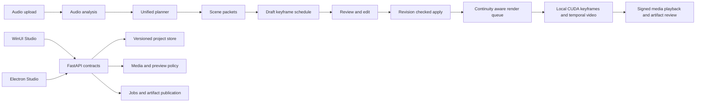

# DWCT Studio Project Blueprint

**Prepared:** September 7, 2026  
**Applies to:** `codex/Unified` in `E:\DWCTGenerativeSoundStudio`  
**Product:** EDMG Studio, including the WinUI desktop app, Electron/React desktop app, FastAPI backend, local CUDA runtime, and release tooling

## Purpose and authority

This blueprint consolidates the repository remediation plan, the Unified AI Planner and Automatic Key plan, and the decisions made during this work session. It is the working implementation map for bringing the Studio to a secure, save-safe, native-first production state.

The two source Markdown files are planning inputs. They define desired outcomes and acceptance criteria; they do not authorize destructive actions, external publication, large model downloads, installer execution, pagefile changes, commits, or pushes by themselves. Those actions require a direct user request. Existing tracked, untracked, staged, and generated work remains preserved unless a later task explicitly changes it.

## Product outcome

EDMG Studio should let a creator import audio, analyze it, create a coherent multi-scene plan, review the plan as editable structured data, lock character and style continuity, generate keyframes and temporal video locally, and save or reload the complete project without losing scene handoffs or overwriting another writer’s changes.

The Windows UI is the first delivery target. It must provide the full planning, review, edit, save, media, render, and error-handling workflow without crashes. Electron must then expose the same backend contracts and preserve the workflow already available there. The backend remains the single source of truth for project state, revisions, media authorization, planning, and terminal job outcomes.



## Guiding decisions

| Decision | Required behavior |
|---|---|
| Native-first delivery | Build and prove the WinUI workflow before treating Electron parity as complete. Electron remains supported and must use the same API contracts. |
| Backend authority | Clients send intended mutations with an expected revision. The server owns identity, artifact paths, persisted revision, job terminal state, and media authorization. |
| Secure local media | Legacy public media access defaults off. Signed URLs are short-lived, origin-bound, containment-checked, and return `Cache-Control: no-store`. |
| Continuity as data | Project-wide locks, scene settings, shot type, start state, end state, exact handoffs, keyframe references, and schedule decisions are explicit persisted fields. |
| Safe mutation | Save, upload, planning application, recovery, and render actions return the resulting revision. Conflicts become reload-and-reapply workflows instead of silent overwrites. |
| Real CUDA proof | A proof is complete only after a newly produced temporal MP4 is inspected and evidenced. Keyframe assembly, a still slideshow, proxy rendering, hosted inference, or mock output cannot satisfy it. |
| Resource discipline | Keep the native WinUI media spool default at 512 MiB with a configurable override. Do not automatically download models or alter pagefile settings. Serialize model loading on the available GPU. |

## Current delivery baseline

The following is a checkpoint, not a declaration that every item is complete. Recheck it before the next implementation batch because the repository is actively being changed.

| Area | Recorded state | Required next evidence |
|---|---|---|
| Storyboard continuity | Save and reload work has been implemented for setting, shot type, character and style locks, start state, end state, and scene handoffs. Reordering must preserve the exact outgoing and incoming handoff payloads. | Focused backend, Electron, and WinUI continuity regressions against the current worktree. |
| Media security | Media signing helpers and core remediation integration have landed in prior checkpoints. | Full issuance, tampering, containment, range, HEAD, rotation, preview, and error-cache regressions. |
| Planner foundation | Backend planner schedule models and routes, Electron contract work, and current WinUI planner work are present in the active worktree. | WinUI-first native workflow test and app-build evidence, then Electron parity tests. |
| WinUI stability | Token provider merge damage and native client behavior have been under repair. | Core tests, application build, and manual launched-app workflow evidence without dispatcher or cancellation crashes. |
| CUDA runtime | Earlier readiness was blocked by a CPU-only environment; a later environment inspection reported CUDA-capable Torch. | A fresh preflight immediately before a proof run, including actual process command line, GPU memory, pagefile/commit headroom, models, project, and worker configuration. |
| Historical checkpoints | Remediation and CUDA-readiness checkpoint commits were created and pushed during this session. | `git status`, branch equality, and ownership review before any later commit. |

## Architecture and canonical contracts

### Project document

The persisted project document preserves unknown legacy fields during migration. Known continuity fields are normalized rather than discarded:

```json
{
  "id": "project-id",
  "revision": 42,
  "settings": {
    "project_setting": "night forest at blue hour",
    "character_locks": ["lead subject silhouette and wardrobe"],
    "style_locks": ["cinematic grain", "cool moonlit palette"]
  },
  "scenes": [
    {
      "id": "scene-1",
      "setting": "night forest at blue hour",
      "shot_type": "wide establishing",
      "start_state": { "subject_pose": "standing at trailhead" },
      "end_state": { "subject_pose": "walking toward camera" },
      "handoff": { "to_scene_id": "scene-2", "state": "subject enters left foreground" }
    }
  ],
  "planner": {
    "scene_packets": [],
    "keyframe_schedule": [],
    "review_state": "draft"
  }
}
```

The shown shape is illustrative. The implementation must retain compatible fields rather than replacing legacy documents with only this subset.

### Revision contract

Every interactive mutation of an existing project carries `expected_revision` in JSON and multipart requests. The store serializes mutations across store instances and increments exactly once per persisted mutation.

| Situation | API response |
|---|---|
| New project create | Server creates the project and returns the initial persisted revision. |
| Existing mutation without revision | Stable precondition error. |
| Existing mutation with stale revision | HTTP 409 with expected and current revisions. |
| Successful mutation | Updated resource plus resulting revision. |
| Background update | Narrowly owned field update against current state; deterministic merge retries at most three times. |
| Canceled job | Remains terminally canceled even if the worker later returns or throws. |

### Signed media contract

`POST /v1/projects/{project_id}/media-urls` returns the client-ordered batch response:

```json
{
  "urls": [
    { "request_id": "scene-1-start", "url": "/v1/projects/...", "purpose": "preview" }
  ],
  "expires_at": "2026-09-07T12:00:00Z"
}
```

Supported request purposes remain `file`, `audio`, and `preview`. Preview requests include an explicit kind where needed, mapped only to allowlisted frame, segment, or diffusion preview routes. Audio resolves the stored server-side filename; callers do not supply it.

Signatures cover the method, canonical route, sorted query parameters, project, purpose, and expiration. HEAD verifies as GET. Issuance uses the current configured signing secret, or a domain-separated backend-token key; unauthenticated local operation uses a process-local random key. Previous configured keys verify only. The normal lifetime is 900 seconds, and configured/requested lifetime is accepted only from 60 through 3,600 seconds.

All media requests enforce canonical project-directory containment both at issuance and in the media route. Reject absolute paths, traversal, malformed encoding, metadata-derived path escapes, and symlink escapes. Authentication mode never bypasses containment or preview limits. Signed responses, range responses, and signed error responses carry `Cache-Control: no-store`.

### Preview and metadata policy

Preview validation occurs before decode, cache generation, or rendering. All configuration and request bounds must be finite and positive.

| Limit | Standard preview | Diffusion preview |
|---|---:|---:|
| Maximum dimension | 2,048 | 1,024 |
| Maximum duration | 10 seconds | 5 seconds |
| Maximum FPS | 12 | 8 |
| Maximum frames | 120 | 40 |
| Maximum pixel-frames | 125,829,120 | 41,943,040 |
| Maximum diffusion steps | N/A | 30 |
| Maximum pixels per frame | 4,194,304 | 4,194,304 |

Autosave and recovery use bounded metadata validation. They reject server-owned identity, revision, audio, artifact, and path-bearing fields, retain depth and serialized-size limits, and merge allowed metadata without deleting unrelated values.

## Workstream A  Secure backend and durable project state

### A1  Finish media authorization and containment

1. Complete authenticated batch issuance and ordered response validation.
2. Cover projects files, uploaded audio, and explicitly allowlisted previews.
3. Canonicalize and contain all routes and targets at issuance and serving time.
4. Enforce signing, signature rotation, method policy, lifetime limits, cache policy, range handling, and HEAD equivalence.
5. Keep legacy public media only behind its explicit compatibility switch, defaulting to disabled.

**Exit evidence:** route-level tests prove valid issuance, rejected malformed inputs, tampered signatures, duplicate signing fields, expired signatures, unsupported methods, rotation verification, ranges, HEAD, cache headers, containment, encoded traversal, symlink escape, and public-mode containment.

### A2  Complete revision, migration, and cancellation contracts

1. Locate every interactive project write, multipart upload, planner application, autosave, recovery update, and artifact registration.
2. Route each write through synchronized, typed revision-aware project mutation APIs.
3. Make final publication and artifact registration conditional on a job that is still eligible to publish.
4. Preserve unknown legacy fields on load, migration, save, and recovery.
5. Return revision values consistently from mutation endpoints and client adapters.

**Exit evidence:** concurrent store tests, legacy migration tests, missing/stale revision tests, ownership-aware narrow updates, deterministic retry limits, and cancellation-versus-publication race tests.

### A3  Complete planner and automatic keyframe schedule services

1. Produce validated scene packets from audio analysis, project context, continuity locks, and user instructions.
2. Compile a draft schedule with keyframe boundaries, fixed seeds, prompt additions, expected motion, transition handoff, render tier, and review status.
3. Validate schedule mutations against the project revision and explicitly preserve user edits when replanning.
4. Provide stable API models suitable for both native and Electron clients.
5. Keep planning independent from actual model execution so a user can review and correct a draft before expensive generation.

**Exit evidence:** unit and integration tests for packet validation, schedule ordering, exact handoff transfer, invalid input rejection, revision conflicts, replan merge policy, and route serialization.

## Workstream B  Windows UI first

### B1  Make the native API layer stable

1. Repair the token provider structure while retaining process-wide invalidation, missing-credential caching, fallback-token precedence, and a testable credential-store abstraction.
2. Ensure save and clear invalidate providers already created or in flight.
3. Keep setup authentication, transport errors, cancellation, and health failures separately classified.
4. Marshal every UI state mutation through the dispatcher.
5. Validate media issuance response origin against the selected normalized backend origin.
6. Preserve byte-range playback; reject known oversized downloads; bounded-copy unknown lengths; remove partial files on failure or cancellation.

**Native media default:** preserve the current 512 MiB spool ceiling. Expose a clearly named configuration override, validate it, and report the active limit in the settings or status UI.

### B2  Deliver the native planning and continuity workflow

The WinUI workflow must support:

1. Selecting or creating a project and loading its current revision.
2. Uploading audio and waiting through adaptive, serialized polling.
3. Viewing audio analysis and creating a planner draft.
4. Viewing every scene packet, including setting, shot type, character/style locks, start state, end state, and handoff.
5. Editing or locking planned fields before application.
6. Applying a schedule with the expected revision and receiving the new revision.
7. Showing a conflict with explicit reload-and-reapply controls.
8. Saving, reopening, and reordering scenes while preserving exact handoff data.
9. Requesting and renewing signed media for previews, audio, keyframes, and artifacts.
10. Displaying model/security/limit status in settings or status surfaces in language a creator can act on.

### B3  WinUI quality gates

| Gate | Required proof |
|---|---|
| Core correctness | Focused Core tests for token races, media contract/origin, spool limit, cleanup, revisions, planner models, and handoffs. |
| App compilation | Native application build with the repository-selected SDK. Report the SDK actually used; do not alter the repository pin to make a build pass. |
| Runtime behavior | Launch a built native app, exercise project load, planner review, save/reload, media request failure, and cancellation without a crash. |
| UI thread safety | Tests and manual exercise show no direct worker-thread widget update and no post-disposal callback. |

## Workstream C  Electron parity after WinUI stability

### C1  Signed media lifecycle

Electron captures one normalized backend URL when beginning issuance. It validates each response origin, rejects cross-origin URLs, discards late results from a superseded backend, cancels obsolete requests and timers, revokes temporary object URLs, and preserves video position plus play/pause state during renewal.

### C2  Revision-aware product flow

Carry revisions through project save, autosave recovery, uploads, planner application, and render controls. Refresh state after each mutation. Offer a reload-and-reapply action for a conflict and never overwrite quietly.

### C3  Continuity and planner parity

Expose the same scene-packet and schedule review data as WinUI, including automatic keyframe choices, keyframe/continuity locks, scene start/end states, and exact handoffs. Existing picker cancellation and empty-selection behavior, adaptive polling, and backend-scoped provider reset logic must be verified before further replacement.

### C4  Electron quality gates

Run focused tests for renewal during playback, failed renewal and retry, unmount cancellation, backend switching during an in-flight request, conflicts, serialized polling, picker cancellation, empty selection, continuity save/reload/reorder, and every media consumer. Then run lint, typecheck, and the full UI suite.

## Workstream D  Render orchestration and internal CUDA proof

### D1  Adaptive render engine

The execution engine consumes an approved schedule rather than raw unstructured UI state. For each scene it selects an available local model tier, records the chosen model and device, uses a fixed seed when required, passes the prior approved handoff into the next scene, and records why any fallback occurred. Hosted, proxy, CPU, mock, and still-slideshow fallbacks are disabled for the internal proof lane.

### D2  Preflight before proof

Immediately before an inference attempt, capture fresh evidence for:

- GPU model, free and total VRAM, and active GPU consumers.
- System memory, pagefile size, and commit headroom.
- Backend process command line, selected accelerator profile, and health response.
- Active project identifier and revision, proof-project location, worker configuration, model availability, and cache state.
- Installed local FLUX keyframe model, temporal video model, and motion adapter as applicable.

Use an isolated proof project and a fresh output directory. Do not modify the user’s active creative project.

### D3  Proof run specification

Create a short two-scene sequence with project-wide continuity, FLUX-generated keyframes, an installed internal temporal video model, fixed seeds, the smallest supported model resolution, and enough native frames to inspect actual motion. Generate a short local test-tone audio track only to verify muxing. Serialize model loading on the available GPU.

### D4  Proof acceptance package

The proof is accepted only when it includes:

1. A newly produced MP4 and SHA-256 artifact hash.
2. Codec, resolution, frame count, duration, and audio-stream inspection evidence.
3. Sampled frames and temporal-motion analysis showing generated motion rather than a slideshow.
4. Exact structured scene handoffs, keyframe continuity records, seeds, job IDs, project revision, model/device provenance, worker configuration, and cache status.
5. A clear explanation of whether FLUX generated the keyframes and which installed temporal model generated the motion.

If model readiness fails, headroom is insufficient, the backend chooses a forbidden fallback, or frame inspection shows no temporal motion, mark the proof **blocked** or **failed** and name the missing prerequisite. Do not label a preflight, cache artifact, or still sequence as completed proof.

## Workstream E  Operations, launchers, and installer hardening

### E1  Go supervisor

Verify readiness before state publication. On readiness failure, terminate and wait for the exact child tree, remove only matching state, and retain the original readiness error with cleanup details.

### E2  Tk launcher

Verify that worker-thread work reaches widgets and dialogs only through the dispatcher. Suppress callbacks after disposal and restore busy controls on success, failure, and cancellation.

### E3  Linux setup and release inputs

Verify pinned download URLs and repository commits, checksum-before-execution, temporary download locations, atomic publication, owned-PID cleanup, explicit upgrade overrides, and checked-in dependency inputs. A missing checksum for a gated model must fail clearly; no checksum is invented.

### E4  Python installer

Resolve one interpreter target and use that same target for environment creation, package installation, version checks, imports, and smoke tests. Detect and report mismatches clearly.

## Delivery sequence

| Milestone | Scope | Gate before the next milestone |
|---|---|---|
| 0. Baseline ledger | Record branch, commit, dirty inventory, test environment, and known failures. Make a finding-to-test checklist. | Ownership of every existing change is clear; no unrelated file is reset or deleted. |
| 1. Backend safety | Media, preview, metadata, revision, and cancellation contracts. | Focused backend tests pass, including malformed and race cases. |
| 2. WinUI stability | Token provider, API client, spool behavior, dispatcher, media, revisions, planning, and continuity UI. | Core tests and native build pass; manually exercised app workflow does not crash. |
| 3. Electron parity | Signed media lifecycle, revisions, planner review, continuity, polling, and UI errors. | Focused Electron tests, then lint, typecheck, and full UI suite pass. |
| 4. Operations hardening | Supervisor, launcher, Linux setup, and Python installer. | Focused support and non-mutating policy tests pass. |
| 5. Full validation | Frozen backend scope and repository scope in separate temporary directories. | Failures are classified as baseline/environment or introduced regression with exact evidence. |
| 6. CUDA proof | Fresh preflight and isolated two-scene temporal run. | New MP4 and complete evidence package meet every proof requirement. |

## Verification matrix

The commands below are the intended validation ladder. Run the narrowest relevant command first and record exact command, exit code, test count, SDK/interpreter, and failure output.

| Layer | Focused validation | Broader validation |
|---|---|---|
| Backend | Signature, media containment, preview limits, metadata, revisions, migration, ownership, cancellation, planner schedule, and storyboard handoff tests. | `uv run --project studio/edmg-studio/python_backend --frozen --extra cpu --extra core --extra audio --group test python -m pytest` |
| Python scopes | Affected test modules with a unique temporary project/data directory. | `uv run --project studio/edmg-studio/python_backend --frozen --extra cpu --extra core --extra audio --group test python scripts/run_pytest_scopes.py` |
| Electron | `pnpm exec vitest run <focused-test-file> --maxWorkers=1` from `studio/edmg-studio`. | `pnpm run test:ui`, `pnpm run lint`, and `pnpm run typecheck` from `studio/edmg-studio`. |
| WinUI | Focused `EdmgStudio.Core.Tests` for affected API and workflow classes. | Full Core test project followed by application build with the pinned SDK. |
| Go, launcher, installers | Path-scoped support tests and non-mutating shell syntax/checksum-policy checks. | Relevant project test suites once focused checks pass. |
| CUDA proof | Preflight scripts and artifact inspection only after all readiness conditions are true. | No broad model download, installer execution, or system setting change is implied. |

## Finding-to-test checklist

| Finding | Implementation owner | Verification status field |
|---|---|---|
| Signed media issuance and canonical signatures | Backend | `not run` / `passing` / `failing` with test name |
| Path containment and preview allowlist | Backend | `not run` / `passing` / `failing` with test name |
| Preview limits and metadata reservations | Backend | `not run` / `passing` / `failing` with test name |
| Revision and cancellation races | Backend/store/jobs | `not run` / `passing` / `failing` with test name |
| Storyboard save, reload, and exact reorder handoffs | Backend + WinUI + Electron | `not run` / `passing` / `failing` with test name |
| Planner packet, draft schedule, review, and apply | Backend + WinUI + Electron | `not run` / `passing` / `failing` with test name |
| WinUI token invalidation and bounded spool cleanup | WinUI | `not run` / `passing` / `failing` with test name |
| WinUI setup error classification and dispatcher behavior | WinUI | `not run` / `passing` / `failing` with test name |
| Electron media renewal and backend switch safety | Electron | `not run` / `passing` / `failing` with test name |
| Supervisor, launcher, Linux, and installer contracts | Operations | `not run` / `passing` / `failing` with test name |
| Internal CUDA temporal proof | Runtime | `blocked`, `failed`, or `accepted` with artifact evidence |

## Safety rules for implementation and review

1. Begin every new batch by recording `git status --short`, branch, HEAD, and the expected set of files for that batch.
2. Stage explicit paths only. Keep pre-existing, generated, and untracked files distinguishable in every report and commit.
3. Do not change dependencies, SDK pins, model selection, test timeouts, or system settings merely to make a check appear green.
4. Do not convert an implementation status into completion based only on compilation, a listener on a port, a cached artifact, or a health endpoint.
5. Avoid whole-project background saves. Use narrow owned-field mutations and a small deterministic retry budget.
6. Preserve user-created metadata and unknown compatible document fields through migrations.
7. Make UI failure states actionable: describe the failed operation, backend identity, revision or size limit when relevant, and the next safe user action.
8. Keep local-only proof runs isolated, reproducible, and fully attributed to their runtime, model, project revision, and artifacts.

## Planned report format for each implementation batch

Each batch report should state:

1. The concrete behavior changed and the user-visible result.
2. Exact changed files, separated into implementation, tests, documentation, generated outputs, and preserved pre-existing work.
3. Test commands, outcomes, and the actual Python/.NET/Node SDK or runtime used.
4. Known failures or unverified conditions, including whether they predated the batch.
5. For any CUDA work, command-line provenance, hardware preflight, project/revision, job IDs, artifact paths/hashes, and frame/media inspection results.
6. Commit and push evidence only when a direct request authorizes them.

## Definition of done

The project is ready for the intended Studio workflow only when:

- WinUI can complete the full create/import/analyze/plan/review/apply/save/reload/reorder/media/render workflow without a crash and with conflict handling.
- Electron offers matching backend behavior and passes its media, continuity, planner, and revision regressions.
- Backend tests establish secure media, preview, metadata, revision, migration, and cancellation behavior with malicious and concurrent inputs.
- Operations checks prove the supervisor, launchers, and installers retain their safety contracts.
- All full validation failures are either fixed or explicitly classified with reproducible evidence.
- The CUDA proof either meets every fresh-artifact and temporal-motion criterion or is transparently recorded as blocked or failed.

## Source mapping

This blueprint combines the requirements in these repository-root source documents and expands them with session-specific sequencing and verification boundaries:

- `# Whole-project remediation plan.md`: security, persistence, client, operations, validation, and CUDA-proof requirements.
- `# Unified AI Planner, Automatic Key.md`: scene packet, automatic keyframe schedule, review-and-apply, and adaptive rendering requirements.
- `docs/unified-remediation-execution-plan.md`: current execution-oriented consolidation retained alongside this fuller blueprint.

