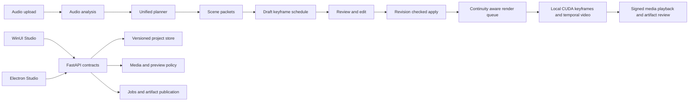

docs/DWCT-Studio-Project-Blueprint.md
# DWCT Studio Project Blueprint

**Prepared:** September 7, 2026  
**Applies to:** `codex/Unified` in `E:\DWCTGenerativeSoundStudio`  
**Product:** EDMG Studio, including the WinUI desktop app, Electron/React desktop app, FastAPI backend, local CUDA runtime, and release tooling

## Purpose and authority

This blueprint consolidates the repository remediation plan, the Unified AI Planner and Automatic Key plan, and the decisions made during this work session. It is the working implementation map for bringing the Studio to a secure, save-safe, native-first production state.

The two source Markdown files are planning inputs. They define desired outcomes and acceptance criteria; they do not authorize destructive actions, external publication, large model downloads, installer execution, pagefile changes, commits, or pushes by themselves. Those actions require a direct user request. Existing tracked, untracked, staged, and generated work remains preserved unless a later task explicitly changes it.

## Product outcome

EDMG Studio should let a creator import audio, analyze it, create a coherent multi-scene plan, review the plan as editable structured data, lock character and style continuity, generate keyframes and temporal video locally, and save or reload the complete project without losing scene handoffs or overwriting another writer’s changes.

The Windows UI is the first delivery target. It must provide the full planning, review, edit, save, media, render, and error-handling workflow without crashes. Electron must then expose the same backend contracts and preserve the workflow already available there. The backend remains the single source of truth for project state, revisions, media authorization, planning, and terminal job outcomes.



## Guiding decisions

| Decision | Required behavior |
|---|---|
| Native-first delivery | Build and prove the WinUI workflow before treating Electron parity as complete. Electron remains supported and must use the same API contracts. |
| Backend authority | Clients send intended mutations with an expected revision. The server owns identity, artifact paths, persisted revision, job terminal state, and media authorization. |
| Secure local media | Legacy public media access defaults off. Signed URLs are short-lived, origin-bound, containment-checked, and return `Cache-Control: no-store`. |
| Continuity as data | Project-wide locks, scene settings, shot type, start state, end state, exact handoffs, keyframe references, and schedule decisions are explicit persisted fields. |
| Safe mutation | Save, upload, planning application, recovery, and render actions return the resulting revision. Conflicts become reload-and-reapply workflows instead of silent overwrites. |
| Real CUDA proof | A proof is complete only after a newly produced temporal MP4 is inspected and evidenced. Keyframe assembly, a still slideshow, proxy rendering, hosted inference, or mock output cannot satisfy it. |
| Resource discipline | Keep the native WinUI media spool default at 512 MiB with a configurable override. Do not automatically download models or alter pagefile settings. Serialize model loading on the available GPU. |

## Current delivery baseline

The following is a checkpoint, not a declaration that every item is complete. Recheck it before the next implementation batch because the repository is actively being changed.

| Area | Recorded state | Required next evidence |
|---|---|---|
| Storyboard continuity | Save and reload work has been implemented for setting, shot type, character and style locks, start state, end state, and scene handoffs. Reordering must preserve the exact outgoing and incoming handoff payloads. | Focused backend, Electron, and WinUI continuity regressions against the current worktree. |
| Media security | Media signing helpers and core remediation integration have landed in prior checkpoints. | Full issuance, tampering, containment, range, HEAD, rotation, preview, and error-cache regressions. |
| Planner foundation | Backend planner schedule models and routes, Electron contract work, and current WinUI planner work are present in the active worktree. | WinUI-first native workflow test and app-build evidence, then Electron parity tests. |
| WinUI stability | Token provider merge damage and native client behavior have been under repair. | Core tests, application build, and manual launched-app workflow evidence without dispatcher or cancellation crashes. |
| CUDA runtime | Earlier readiness was blocked by a CPU-only environment; a later environment inspection reported CUDA-capable Torch. | A fresh preflight immediately before a proof run, including actual process command line, GPU memory, pagefile/commit headroom, models, project, and worker configuration. |
| Historical checkpoints | Remediation and CUDA-readiness checkpoint commits were created and pushed during this session. | `git status`, branch equality, and ownership review before any later commit. |

## Architecture and canonical contracts

### Project document

The persisted project document preserves unknown legacy fields during migration. Known continuity fields are normalized rather than discarded:

```json
{
  "id": "project-id",
  "revision": 42,
  "settings": {
    "project_setting": "night forest at blue hour",
    "character_locks": ["lead subject silhouette and wardrobe"],
    "style_locks": ["cinematic grain", "cool moonlit palette"]
  },
  "scenes": [
    {
      "id": "scene-1",
      "setting": "night forest at blue hour",
      "shot_type": "wide establishing",
      "start_state": { "subject_pose": "standing at trailhead" },
      "end_state": { "subject_pose": "walking toward camera" },
      "handoff": { "to_scene_id": "scene-2", "state": "subject enters left foreground" }
    }
  ],
  "planner": {
    "scene_packets": [],
    "keyframe_schedule": [],
    "review_state": "draft"
  }
}
```

The shown shape is illustrative. The implementation must retain compatible fields rather than replacing legacy documents with only this subset.